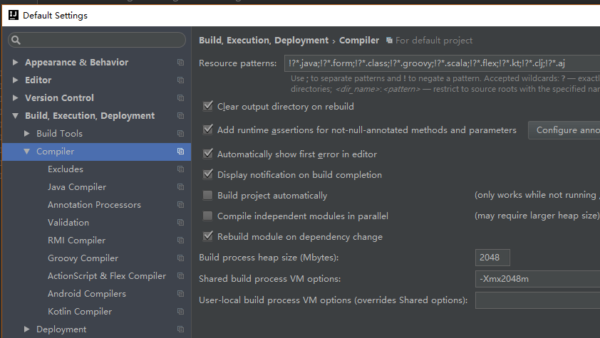

## IDEA常见设置和插件

### 1.设置

```sh
#1.修改为eclipse快捷键 
File -> Settings -> Keymap => Keymaps改为 Eclipse copy
#2.不区分大小写提示
File -> Settings -> Editor -> General -> code completion 最新版去除match case的勾即可
#3.设置项目文件编码
File -> Settings -> Editor -> File Encodings 设置编码格式为UTF-8
#4.鼠标放在方法上显示完整注释
File -> Settings -> Editor -> General -> 勾选Show quick documentation on mouse move
#5.自动导包
File -> Settings -> Editor -> General -> Auto Import -> Add unambiguous imports onthe fly自动导入需要的包但同名的包还需手动导入  Optimize imports on the fly(for current project)自动优化导入的包，比如去除没用的包
#6.整理代码
整理当前文件的代码按快捷键ctrl+alt+L
#7.自动生成get set方法
右键编辑器，选择“Generate”，也可以直接按Alt+Insert快捷键。可以选择Getter和Setter进行分别生成get/set方法。
#8.查看一个类的子类
ctrl+h
#9.用鼠标滚轮调整代码文字大小
在 File > Settings > Keymap > Editor Actions 下，我们可以找到 “Decrease Font Size”和“Increase Font Size”两个选项。分别对应缩小文字和放大文字。
右键，选择“Add Mouse Shortcut”选项。
#10.设置maven
#11.设置jdk
File-->Project Structure-->SDKs-->+jdk
#12.查找替换
ctrl+R 替换
#13. 可以引入变量。例如把括号内的SQL赋成一个变量
Ctrl＋Alt＋V
  
```

### 2.插件

```sh
#1.lombok
开发过程中，通常都会定义大量的JavaBean，然后通过IDE去生成其属性的构造器、getter、setter、equals、hashcode、toString方法，当要对某个属性进行改变时，比如命名、类型等，都需要重新去生成上面提到的这些方法.
@Data相当于@Getter @Setter @RequiredArgsConstructor @ToString @EqualsAndHashCode这5个注解的合集。
通过官方文档，可以得知，当使用@Data注解时，则有了@EqualsAndHashCode注解，那么就会在此类中存在equals(Object other) 和 hashCode()方法，且不会使用父类的属性，这就导致了可能的问题。 比如，有多个类有相同的部分属性，把它们定义到父类中，恰好id（数据库主键）也在父类中，那么就会存在部分对象在比较时，它们并不相等，却因为lombok自动生成的equals(Object other) 和 hashCode()方法判定为相等，从而导致出错。
修复此问题的方法很简单：
（1）、使用@Getter @Setter @ToString代替@Data并且自定义equals(Object other) 和 hashCode()方法，比如有些类只需要判断主键id是否相等即足矣。
（2）、 或者使用在使用@Data时同时加上@EqualsAndHashCode(callSuper=true)注解。设置该属性的话需要保证当前类继承了父类

@slf4j
相当于在类中书写了 private static final Logger log = LoggerFactory.getLogger(User.class);

#2.CodeGlance
在编辑区的右侧显示的代码地图。

#3.Material Theme UI
这是一款主题插件，可以让你的ide的图标变漂亮，配色搭配的很到位，还可以切换不同的颜色，甚至可以自定义颜色。默认的配色就很漂亮了，如果需要修改配色，可以在工具栏中Tools->Material Theme然后修改配色等
```

### 3.问题

```sh
IDEA报错Could not reserve enough space for xxxxKB object heap处理
这个错误的大意就是说IDEA无法给虚拟机分配内存空间。解决这类问题大体是调整idea.exe.vmoptions里面的内存配置。
```




```sh
The Tomcat connector configured to listen on port "端口号" failed to start.
启动服务时总显示端口被占用
#错误解决
1. 打开cmd命令窗口 输入如下指令查看所有端口和PID
netstat -ano
2. 找到对应的端口对应的PID 输入指令找到对应的进程
tasklist | findstr 7676
3. 杀掉该进程 再次启动就OK
taskkill /f /t /im java.exe 
```


### 4.debug

