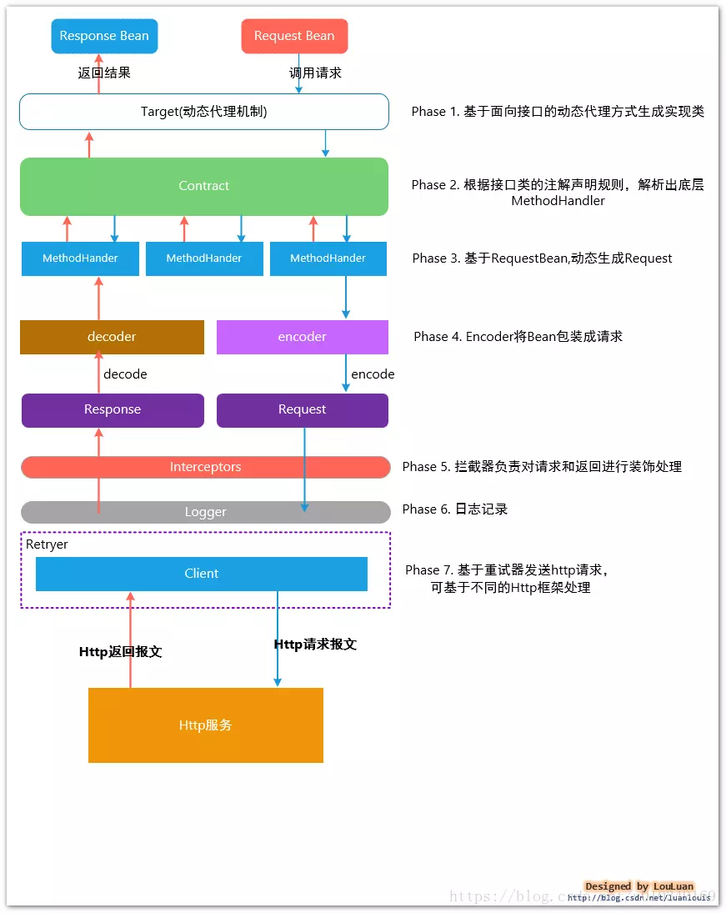

## Java

<https://snailclimb.top/JavaGuide/#/?id=%e5%ae%b9%e5%99%a8>

### 1.transient

**Java中对象的序列化**:指的是将对象转换成以字节序列的形式来表示，这些字节序列包含了对象的数据和信息，一个序列化后的对象可以被写到数据库或文件中，也可用于网络传输，一般当我们使用缓存cache（内存空间不够有可能会本地存储到硬盘）或远程调用rpc（网络传输）的时候，经常需要让我们的实体类实现***Serializable***接口，目的就是为了让其可序列化。当然，序列化后的最终目的是为了反序列化，恢复成原先的Java对象，要不然序列化后干嘛呢，所以序列化后的字节序列都是可以恢复成Java对象的，这个过程就是反序列化。

序列化：将一个对象转换成一串二进制表示的字节数组，通过保存或转移这些字节数据来达到持久化的目的。

反序列化：将字节数组重新构造成对象

Java中**transient**关键字的作用，简单地说，就是让某些被修饰的成员属性变量不被序列化，这一看好像很好理解，就是不被序列化，那么什么情况下，一个对象的某些字段不需要被序列化呢？如果有如下情况，可以考虑使用关键字transient修饰：

1、类中的字段值可以根据其它字段推导出来，如一个长方形类有三个属性：长度、宽度、面积（示例而已，一般不会这样设计），那么在序列化的时候，面积这个属性就没必要被序列化了；

2、其它，看具体业务需求吧，哪些字段不想被序列化.为什么要不被序列化呢，主要是为了节省存储空间，其它的感觉没啥好处，可能还有坏处（有些字段可能需要重新计算，初始化什么的），总的来说，**利大于弊**。

```sh
import java.io.FileInputStream;
import java.io.FileNotFoundException;
import java.io.FileOutputStream;
import java.io.IOException;
import java.io.ObjectInputStream;
import java.io.ObjectOutputStream;
import java.io.Serializable;

/**
 * @description 使用transient关键字不序列化某个变量
 *        注意读取的时候，读取数据的顺序一定要和存放数据的顺序保持一致
 *        
 * @author Alexia
 * @date  2013-10-15
 */
public class TransientTest {
    
    public static void main(String[] args) {
        
        User user = new User();
        user.setUsername("Alexia");
        user.setPasswd("123456");
        
        System.out.println("read before Serializable: ");
        System.out.println("username: " + user.getUsername());
        System.err.println("password: " + user.getPasswd());
        
        try {
            ObjectOutputStream os = new ObjectOutputStream(
                    new FileOutputStream("C:/user.txt"));
            os.writeObject(user); // 将User对象写进文件
            os.flush();
            os.close();
        } catch (FileNotFoundException e) {
            e.printStackTrace();
        } catch (IOException e) {
            e.printStackTrace();
        }
        try {
            ObjectInputStream is = new ObjectInputStream(new FileInputStream(
                    "C:/user.txt"));
            user = (User) is.readObject(); // 从流中读取User的数据
            is.close();
            
            System.out.println("\nread after Serializable: ");
            System.out.println("username: " + user.getUsername());
            System.err.println("password: " + user.getPasswd());
            
        } catch (FileNotFoundException e) {
            e.printStackTrace();
        } catch (IOException e) {
            e.printStackTrace();
        } catch (ClassNotFoundException e) {
            e.printStackTrace();
        }
    }
}

class User implements Serializable {
    private static final long serialVersionUID = 8294180014912103005L;  
    
    private String username;
    private transient String passwd;
    
    public String getUsername() {
        return username;
    }
    
    public void setUsername(String username) {
        this.username = username;
    }
    
    public String getPasswd() {
        return passwd;
    }
    
    public void setPasswd(String passwd) {
        this.passwd = passwd;
    }

}
```

输出为：

```sh
read before Serializable: 
username: Alexia
password: 123456

read after Serializable: 
username: Alexia
password: null      //密码字段为null，说明反序列化时根本没有从文件中获取到信息。
```


### 2.Java中Ear、Jar、War文件之间有何不同

在文件结构上，三者并没有什么不同，它们都采用zip或jar档案文件压缩格式。但是它们的使用目的有所区别：

　　**Jar文件**（扩展名为. Jar）包含Java类的普通库、资源（resources）、辅助文件（auxiliary files）等

　　**War文件**（扩展名为.War）包含全部Web应用程序。在这种情形下，一个Web应用程序被定义为单独的一组文件、类和资源，用户可以对jar文件进行封装，并把它作为小型服务程序（servlet）来访问。

　　**Ear文件**（扩展名为.Ear）包含全部企业应用程序。在这种情形下，一个企业应用程序被定义为多个jar文件、资源、类和Web应用程序的集合。

　　每一种文件（.jar, .war, .ear）只能由应用服务器（application servers）、小型服务程序容器（servlet containers）、EJB容器（EJB containers）等进行处理

jar--封装类

war--封装web站点

ear--封装ejb。

它们的关系具体为：

jar:是java Achieve--按java格式压缩的类包，包含内容 class、properties文件，是文件封装的最小单元 级别：**小**

war:是file web Achieve--包含Servlet、JSP页面、JSP标记库、JAR库文件HTML/XML文档和其他公用资源文件，如图片、音频文件等 级别：**中**

ear:是 file Enterprise Achieve--除了包含JAR、WAR以外，还包括EJB组件   部署文件 application-client.xml web.xml application.xml    级别：**大**

ear包：企业级应用，通常是EJB打成ear包。 ear是J2ee的应用文件的扩展名 是Enterprise Application Achiever， 是打包了的企业应用程序，里面可包含war(web Application archiever),ejb等 ear包：企业级应用，通常是EJB打成ear包。 war包:是做好一个web应用后，通常是网站，打成包部署到容器中。 jar包：通常是开发时要引用通用类，打成包便于存放管理。

### 3.maven

##### **maven的结构：**

src -main             -java                 -package     -test             -java                 -package     -resources

mvn clean install -Dmaven.test.skip=true    跳过测试


##### **maven 打包方式**：

如果使用[Java](http://lib.csdn.net/base/javase) -jar xxx.jar执行运行jar文件，会出现"no main manifest attribute, in xxx.jar"（没有设置Main-Class）、ClassNotFoundException（找不到依赖包）等错误。

要想jar包能直接通过java -jar xxx.jar运行，需要满足：

1、在jar包中的META-INF/MANIFEST.MF中指定Main-Class，这样才能确定程序的入口在哪里；

​      （       1.打包时指定了主类，可以直接用java -jar {xxx.jar}。
​                 2.打包时没有指定主类，可以用java -cp {xxx.jar} {主类名称（绝对路径）}。
​                 3.要引用其他的jar包，可以用java -{[classpath|cp]} {$CLASSPATH}:{xxxx.jar} {主类名称（绝对路  径）}。其中 -classpath 指定需要引入的类。

​        ）

2、要能加载到依赖包。

使用Maven有以下几种方法可以生成能直接运行的jar包，可以根据需要选择一种合适的方法。

```sh
方法一：使用maven-jar-plugin和maven-dependency-plugin插件打包
在pom.xml中配置：

<build>  
    <plugins>  
  
        <plugin>  
            <groupId>org.apache.maven.plugins</groupId>  
            <artifactId>maven-jar-plugin</artifactId>  
            <version>2.6</version>  
            <configuration>  
                <archive>  
                    <manifest>  
                        <addClasspath>true</addClasspath>  
                        <classpathPrefix>lib/</classpathPrefix>  
                        <mainClass>com.xxg.Main</mainClass>  
                    </manifest>  
                </archive>  
            </configuration>  
        </plugin>  
        <plugin>  
            <groupId>org.apache.maven.plugins</groupId>  
            <artifactId>maven-dependency-plugin</artifactId>  
            <version>2.10</version>  
            <executions>  
                <execution>  
                    <id>copy-dependencies</id>  
                    <phase>package</phase>  
                    <goals>  
                        <goal>copy-dependencies</goal>  
                    </goals>  
                    <configuration>  
                        <outputDirectory>${project.build.directory}/lib</outputDirectory>  
                    </configuration>  
                </execution>  
            </executions>  
        </plugin>  
  
    </plugins>  
</build>  
```

```sh
方法二：使用maven-assembly-plugin插件打包
在pom.xml中配置：

<build>  
    <plugins>  
  
        <plugin>  
            <groupId>org.apache.maven.plugins</groupId>  
            <artifactId>maven-assembly-plugin</artifactId>  
            <version>2.5.5</version>  
            <configuration>  
                <archive>  
                    <manifest>  
                        <mainClass>com.xxg.Main</mainClass>  
                    </manifest>  
                </archive>  
                <descriptorRefs>  
                    <descriptorRef>jar-with-dependencies</descriptorRef>  
                </descriptorRefs>  
            </configuration>  
        </plugin>  
  
    </plugins>  
</build>  
```

```sh
方法三：使用maven-shade-plugin插件打包
在pom.xml中配置：

<build>  
    <plugins>  
  
        <plugin>  
            <groupId>org.apache.maven.plugins</groupId>  
            <artifactId>maven-shade-plugin</artifactId>  
            <version>2.4.1</version>  
            <executions>  
                <execution>  
                    <phase>package</phase>  
                    <goals>  
                        <goal>shade</goal>  
                    </goals>  
                    <configuration>  
                        <transformers>  
                            <transformer implementation="org.apache.maven.plugins.shade.resource.ManifestResourceTransformer">  
                                <mainClass>com.xxg.Main</mainClass>  
                            </transformer>  
                        </transformers>  
                    </configuration>  
                </execution>  
            </executions>  
        </plugin>  
  
    </plugins>  
</build>  
```


**项目样本** 打包成为   stcp-1.0-SNAPSHOT-jar-with-dependencies.jar

```sh
<?xml version="1.0" encoding="UTF-8"?>
<project xmlns="http://maven.apache.org/POM/4.0.0"
         xmlns:xsi="http://www.w3.org/2001/XMLSchema-instance"
         xsi:schemaLocation="http://maven.apache.org/POM/4.0.0 http://maven.apache.org/xsd/maven-4.0.0.xsd">
    <modelVersion>4.0.0</modelVersion>

    <groupId>com.demo</groupId>
    <artifactId>stcp</artifactId>
    <version>1.0-SNAPSHOT</version>
    <packaging>jar</packaging>

    <properties>
        <project.build.sourceEncoding>UTF-8</project.build.sourceEncoding>
        <maven.compiler.source>1.8</maven.compiler.source>
        <maven.compiler.target>1.8</maven.compiler.target>
    </properties>

    <dependencies>
        <dependency>
            <groupId>junit</groupId>
            <artifactId>junit</artifactId>
            <version>4.11</version>
            <scope>test</scope>
        </dependency>
        <dependency>
            <groupId>io.netty</groupId>
            <artifactId>netty-all</artifactId>
            <version>4.1.42.Final</version>
        </dependency>
    </dependencies>

    <build>
        <plugins>
            <plugin>
                <groupId>org.apache.maven.plugins</groupId>
                <artifactId>maven-compiler-plugin</artifactId>
                <version>3.2</version>
                <configuration>
                    <optimize>true</optimize>
                    <source>1.8</source>
                    <target>1.8</target>
                </configuration>
            </plugin>
            <plugin>
                <artifactId>maven-assembly-plugin</artifactId>
                <version>2.6</version>
                <configuration>
                    <descriptorRefs>
                        <descriptorRef>jar-with-dependencies</descriptorRef>
                    </descriptorRefs>
                </configuration>
                <executions>
                    <execution>
                        <phase>package</phase> <!-- bind to the packaging phase -->
                        <goals>
                            <goal>single</goal>
                        </goals>
                    </execution>
                </executions>
            </plugin>

        </plugins>
    </build>
</project>
```

### 4.java类的定义

```
1.定义位置：文件中、其他类中（内部类）
2.内部类：成员内部类、内嵌内部类（static修饰）、局部内部类（定义在方法中）、匿名内部类（没有类名）
在java中，类最常见的定义位置是文件中，一个文件中可以定义多个类，但是只能有一个public的类，而且java文件名必须和这个public类相同。看看下面代码
package com.senmu.pack_a
//TestA.java
public class TestA{}
class TestB{}
class TestC{}
这里有一个TestA.java的源文件，里面定义了三个class。可以看出一个源文件里能定义多个class，但是有且只能有一个public类，非public类的名字只要符合java标识符规则就可以，public类的名字必须和源文件名一致。至于为什么有这个规定，很多网上的帖子都说是为了方便JVM根据文件名找到main函数入口，个人觉得这种说法不太可信也不太合理。原因如下，JVM读取的是编译后的.class文件而不是.java源文件，而定义在一个源文件中的多个类编译后都生成了由各自类名命名的.class文件。在我看来当初java的设计者这样规定的主要目应该是为了给源码阅读提供便利，试想一下如果一个源文件中可以有多个public的class而且名字与源文件名不一致，那么当我们在阅读代码时想要了解某个引用类的定义情况应该去哪找这个类的源代码呢？当有了这个规定之后我们就可以根据import的包名和类名准确找到源文件的位置。至于源文件中的其他非public类，他们只能被本包内的类使用，使用范围有限，命名也就没有严格要求了。
类除了可以定义在文件中还可以定义在其他类中。定义在其他类中的类成为内部类，内部类又可以分成成员内部类和内嵌内部类，其区别在于是否被static修饰符修饰。成员内部类可以访问外部类的所有成员属性和方法，内嵌内部类和普通类没有什么区别只是加了外部类命名限定而已。如下面代码。
package com.senmu.pack_a
//TestA.java
public class TestA{
    private int f1;
    private int f2;

    public TestA(int f1,int f2){
        this.f1 = f1;
        this.f2 = f2;
    }
    public int cal{
        return new TestAInner1().cal();//在外部类中可以像普通类一样使用
    }
    public class TestAInner1{
        public int cal(){
            return f1+f2;//成员内部类可以直接访问外部类的所有公有及私有属性。
        }
    }
    public static class TestInner2{
        public int cal(){
            //return f1+f2 编译错误，因为内嵌内部类不能访问外部类的成员属性。
        return 0;
        }
    }
}

package com.senmu.pack_b
import com.senmu.pack_a.TestA;
//TestB.java
public class TestB{
    private TestA.TestAInner ti = new TestA.TestAInner();//TestA.TestInner是内嵌内部类，可以和普通类一样使用
    public void test(){
        TestA ta = new TestA();
        ta.new TestInner1().cal();//在其他类中使用TestA的成员内部类。

    }
}
最后，java中的类还可以定义在方法中（局部内部类），定义在方法中的类只能在方法中使用，可以看到所有对方法可见的变量。
package com.senmu.pack_a
//TestA.java
public class TestA{
    private int f1;
    private int f2;

    public TestA(int f1,int f2){
        this.f1 = f1;
        this.f2 = f2;
    }
    public int cal(int a){
        class MethodInner{
            public int test(){
                return a + f1 +f2;//方法中内部类可以访问对方法可见所以变量
            }
        }
        return new MethodInner().test();//方法中的内部类只能在本方法中使用。
}
```

### 5.构造方法

```
实例在创建时通过new操作符会调用其对应的构造方法，构造方法用于初始化实例；

没有定义构造方法时，编译器会自动创建一个默认的无参数构造方法；

可以定义多个构造方法，编译器根据参数自动判断；

可以在一个构造方法内部调用另一个构造方法，便于代码复用。

构造器可以有任何访问的修饰符，public、private、protected或者没有修饰符，都可以对构造方法进行修饰。不同于实例方法的是构造方法不能有任何非访问性质的修饰符修饰，例如static、final、synchronized、abstract等都不能修饰构造方法。
```

### 6.方法重载和重写

```
重写(Override)与重载(Overload)
http://www.runoob.com/java/java-override-overload.html
```

### 7.面向对象（封装、继承、多态）

https://www.cnblogs.com/hysum/p/7100874.html

##### **封装**

```sh
#封装：
就是把对象的属性和行为（数据）结合为一个独立的整体，并尽可能隐藏对象的内部实现细节，就是把不想告诉或者不该告诉别人的东西隐藏起来，通过该类提供的方法来实现对隐藏信息的操作和访问。
```

　

```sh
对封装的属性不一定要通过get/set方法，其他方法也可以对封装的属性进行操作。当然最好使用get/set方法.
```

```sh
1.访问修饰符：
  访问权限   类   包  子类  其他包
  public     ∨   ∨    ∨    ∨          （对任何人都是可用的）
  protect    ∨   ∨   ∨    ×　  （继承的类可以访问以及和private一样的权限）
  default    ∨   ∨   ×     ×　　　 （包访问权限，即在整个包内均可被访问）
  private    ∨   ×   ×     ×　　　 （除类型创建者和类型的内部方法之外的任何人都不能访问的元素）
  
从上到下封装性越来越好
```

```sh
2.this 关键字
java 内部类 内部类提供了更好的封装，可以把内部类隐藏在外部类之内，不允许同一个包中的其他类访问该类。
```

##### **继承**

```sh
#继承   extends
继承是类与类的一种关系，是一种“is a”的关系。比如“狗”继承“动物”，这里动物类是狗类的父类或者基类，狗类是动物类的子类或者派生类。
java中的继承是单继承，即一个类只有一个父类。
子类拥有父类的所有属性和方法（除了private修饰的属性不能拥有）从而实现了实现代码的复用
```

```sh
1.子类如果对继承的父类的方法不满意（不适合），可以自己编写继承的方法，这种方式就称为方法的重写。当调用方法时会优先调用子类的方法。
　重写要注意：
　  a、返回值类型
　　b、方法名
　　c、参数类型及个数
　都要与父类继承的方法相同，才叫方法的重写。
```

```sh
2.继承的初始化顺序:
java程序的执行顺序是：
父类对象属性初始化---->父类对象构造方法---->子类对象属性初始化--->子类对象构造方法
```

```sh
3.final
final 修饰类，则该类不允许被继承。final类中的所有成员方法都会被隐式地指定为final方法。
final 修饰方法，则该方法不允许被覆盖(重写)。
final 修饰属性，则该类的该属性不会进行隐式的初始化，所以 该final 属性的初始化属性必须有值，或在构造方法中赋值(但只能选其一，且必须选其一，因为没有默认值！)，且初始化之后就不能改了，只能赋值一次。
final 修饰变量，则该变量的值只能赋一次值，在声明变量的时候才能赋值，即变为常量。
```

```sh
4.super关键字
　在对象的内部使用，可以代表父类对象。
　　1、访问父类的属性：super.age
　　2、访问父类的方法：super.eat()
　super的应用：
　首先我们知道子类的构造的过程当中必须调用父类的构造方法。其实这个过程已经隐式地使用了我们的super关键字。
　这是因为如果子类的构造方法中没有显示调用父类的构造方法，则系统默认调用父类无参的构造方法。
　那么如果自己用super关键字在子类里调用父类的构造方法，则必须在子类的构造方法中的第一行。
　要注意的是：如果子类构造方法中既没有显示调用父类的构造方法，而父类没有无参的构造方法，则编译出错。
```

##### **多态**

```sh
#多态
那么什么是多态呢？多态就是对象的多种形态。（针对某个类型的方法调用，其真正执行的方法取决于运行时期实际类型的方法。）
多态表现在两个方面：
①：引用多态　　　
　　父类的引用可以指向本类的对象；
　　父类的引用可以指向子类的对象；
```


 ```sh
我们不能使用一个子类的引用来指向父类的对象:Dog obj3 = new Animal()
②：方法多态
　　根据上述创建的两个对象：本类对象和子类对象，同样都是父类的引用，当我们指向不同的对象时，它们调用的方法也是多态的。
　　创建本类对象时，调用的方法为本类方法；
　　创建子类对象时，调用的方法为子类重写的方法或者继承的方法；
　　使用多态的时候要注意：如果我们在子类中编写一个独有的方法（没有继承父类的方法），此时就不能通过父类的引用创建的子类对象来调用该方法！！！
　　注意： 继承是多态的基础。(Java中有两种形式可以实现多态：继承（多个子类对同一方法的重写）和接口（实现接口并覆盖接口中同一方法）。)
 ```

```sh
1.引用类型转换
$ 向上类型转换(隐式/自动类型转换)，是小类型转换到大类型。
Dog dog = new Dog();
Animal animal = dog;//自动类型提升，向上转型
$向下类型转换(强制类型转换)，是大类型转换到小类型(有风险,可能出现数据溢出)。
Dog dog = new Dog();
Animal animal = dog;
Dog dog2 = (Dog)animal;
$instanceof运算符，来解决引用对象的类型，避免类型转换的安全性问题。
instanceof是Java的一个二元操作符，和==，>，<是同一类东东。由于它是由字母组成的，所以也是Java的保留关键字。它的作用是测试它左边的对象是否是它右边的类的实例，返回boolean类型的数据。
if(animal instanceof Cat)//判断animal是不是Cat类型

补充说明：在比较一个对象是否和另一个对象属于同一个类实例的时候，我们通常可以采用instanceof和getClass两种方法通过两者是否相等来判断，但是两者在判断上面是有差别的。Instanceof进行类型检查规则是:你属于该类吗？或者你属于该类的派生类吗？而通过getClass获得类型信息采用==来进行检查是否相等的操作是严格的判断,不会存在继承方面的考虑；
```

```sh
2.抽象和接口见下
```

### 8.抽象

```sh
1. 抽象类不能被实例化(初学者很容易犯的错)，如果被实例化，就会报错，编译无法通过。只有抽象类的非抽象子类可以创建对象。
2. 抽象类中不一定包含抽象方法，但是有抽象方法的类必定是抽象类。
3. 抽象类中的抽象方法只是声明，不包含方法体，就是不给出方法的具体实现也就是方法的具体功能。
4. 构造方法，类方法（用 static 修饰的方法）不能声明为抽象方法。
5. 抽象类的子类必须给出抽象类中的抽象方法的具体实现，除非该子类也是抽象类。
#抽象和接口的区别
https://www.cnblogs.com/dolphin0520/p/3811437.html
```

### 9.接口

　　接口，英文称作interface，在软件工程中，接口泛指供别人调用的方法或者函数。从这里，我们可以体会到Java语言设计者的初衷，它是对行为的抽象。在Java中，定一个接口的形式如下：

```
`[``public``] ``interface` `InterfaceName {` `}`
```

　　接口中可以含有 变量和方法。但是要注意，接口中的变量会被隐式地指定为public static final变量（并且只能是public static final变量，用private修饰会报编译错误），而方法会被隐式地指定为public abstract方法且只能是public abstract方法（用其他关键字，比如private、protected、static、 final等修饰会报编译错误），并且接口中所有的方法不能有具体的实现，也就是说，接口中的方法必须都是抽象方法。从这里可以隐约看出接口和抽象类的区别，接口是一种极度抽象的类型，它比抽象类更加“抽象”，并且一般情况下不在接口中定义变量。

　　要让一个类遵循某组特地的接口需要使用implements关键字，具体格式如下：

```
`class` `ClassName ``implements` `Interface1,Interface2,[....]{``}`
```

　　可以看出，**允许一个类遵循多个特定的接口**。如果一个非抽象类遵循了某个接口，就必须实现该接口中的所有方法。对于遵循某个接口的抽象类，可以不实现该接口中的抽象方法。

### 10.线程池及多线程

##### 线程状态及概念

新建(New)、就绪（Runnable）、运行（Running）、阻塞(Blocked)和死亡(Dead)5种状态


线程创建之后它将处于 **NEW（新建）** 状态，调用 `start()` 方法后开始运行，线程这时候处于 **READY（可运行）** 状态。可运行状态的线程获得了 cpu 时间片（timeslice）后就处于 **RUNNING（运行）** 状态。

> 操作系统隐藏 Java虚拟机（JVM）中的 READY 和 RUNNING 状态，它只能看到 RUNNABLE 状态（图源：[HowToDoInJava](https://howtodoinjava.com/)：[Java Thread Life Cycle and Thread States](https://howtodoinjava.com/java/multi-threading/java-thread-life-cycle-and-thread-states/)），所以 Java 系统一般将这两个状态统称为 **RUNNABLE（运行中）** 状态 。

当线程执行 `wait()`方法之后，线程进入 **WAITING（等待）**状态。进入等待状态的线程需要依靠其他线程的通知才能够返回到运行状态，而 **TIME_WAITING(超时等待)** 状态相当于在等待状态的基础上增加了超时限制，比如通过 `sleep（long millis）`方法或 `wait（long millis）`方法可以将 Java 线程置于 TIMED WAITING 状态。当超时时间到达后 Java 线程将会返回到 RUNNABLE 状态。当线程调用同步方法时，在没有获取到锁的情况下，线程将会进入到 **BLOCKED（阻塞）** 状态。线程在执行 Runnable 的`run()`方法之后将会进入到 **TERMINATED（终止）** 状态。

 ```sh
#抢占式调度
优先让优先级高的线程使用 CPU，如果线程的优先级相同，那么会随机选择一个(线程随机性)，Java使用的为抢占式调度。
 ```

```sh
#运用多线程会出现的常见问题
1.当有全局性的参数的时候，需要为每个线程单独深度复制一个参数对象，不然在一个线程中对参数的修改可能会影响其他线程中参数的值，而造成间歇性的错误，不容易排查；
2.死锁问题--是当两个线程互相等待获取对方的对象监视器时就会发生死锁。一旦出现死锁，整个程序既不会出现异常也不会有提示，但所有线程都处于阻塞状态。死锁一般出现于多个同步监视器的情况。
（1）两个线程里面分别持有两个Object对象：lock1和lock2。这两个lock作为同步代码块的锁；
（2）线程1的run()方法中同步代码块先获取lock1的对象锁，Thread.sleep(xxx)，时间不需要太多，50毫秒差不多了，然后接着获取lock2的对象锁。这么做主要是为了防止线程1启动一下子就连续获得了lock1和lock2两个对象的对象锁
（3）线程2的run)(方法中同步代码块先获取lock2的对象锁，接着获取lock1的对象锁，当然这时lock1的对象锁已经被线程1锁持有，线程2肯定是要等待线程1释放lock1的对象锁的
这样，线程1"睡觉"睡完，线程2已经获取了lock2的对象锁了，线程1此时尝试获取lock2的对象锁，便被阻塞，此时一个死锁就形成了。
```

```sh
#结束线程的方法
interrupt()方法
1. 线程处于阻塞状态：如使用了sleep,同步锁的wait,socket中的receiver,accept等方法时，会使线程处于阻塞状态。当调用线程的interrupt()方法时，会抛出InterruptException异常。阻塞中的那个方法抛出这个异常，通过代码捕获该异常，然后break跳出循环状态，从而让我们有机会结束这个线程的执行。通常很多人认为只要调用interrupt方法线程就会结束，实际上是错的， 一定要先捕获InterruptedException异常之后通过break来跳出循环，才能正常结束run方法。
2. 线程未处于阻塞状态：使用isInterrupted()判断线程的中断标志来退出循环。当使用interrupt()方法时，中断标志就会置true，和使用自定义的标志来控制循环是一样的道理。

stop()方法
调用thread.stop()后导致了该线程所持有的所有锁的突然释放(不可控制)，那么被保护数据就有可能呈现不一致性，其他线程在使用这些被破坏的数据时，有可能导致一些很奇怪的应用程序错误。因此，并不推荐使用stop方法来终止线程。
```

```sh
#线程方法
线程让步（yield） 
yield会使当前线程让出CPU执行时间片，与其他线程一起重新竞争CPU时间片。一般情况下，优先级高的线程有更大的可能性成功竞争得到CPU时间片，但这又不是绝对的，有的操作系统对线程优先级并不敏感。

Join
等待其他线程终止 join() 方法，等待其他线程终止，在当前线程中调用一个线程的 join() 方法，则当前线程转为阻塞状态，回到另一个线程结束，当前线程再由阻塞状态变为就绪状态，等待 cpu 的宠幸。
例题：现在有T1,T2,T3三个线程，你怎样保证T2在T1执行后执行，T3在T2执行后执行。

线程唤醒（notify） 
Object 类中的 notify() 方法，唤醒在此对象监视器上等待的单个线程，如果所有线程都在此对象上等待，则会选择唤醒其中一个线程，选择是任意的，并在对实现做出决定时发生，线程通过调用其中一个 wait() 方法，在对象的监视器上等待，直到当前的线程放弃此对象上的锁定，才能继续执行被唤醒的线程，被唤醒的线程将以常规方式与在该对象上主动同步的其他所有线程进行竞争。类似的方法还有 notifyAll() ，唤醒再次监视器上等待的所有线程。
```


##### 代码演示

```sh
#继承Thread
public class Dog extends Thread{
    @Override
    public void run() {
         for (int i=2;i<100;i++){
             System.out.println("dog run " + i + " steps");
         }
    }
}

public class Running {
    public static void main(String[] args){
        Cat cat = new Cat();
        Dog dog = new Dog();
        dog.start();
        cat.start();
        for(int i=2;i<100;i++){
            System.out.println("main run " + i + " steps");
        }
    }
}

#实现Runnable接口
public class Apple implements Runnable {
    @Override
    public void run() {
        for (int i=1; i<=11; i++) {
            System.out.println(Thread.currentThread().getName()+" will buy iphone" + i);
        }
    }
}

public class Running {
    public static void main(String[] args) {
        //创建实例对象
        Apple apple = new Apple();
        //创建多线程
        Thread thread1 = new Thread(apple, "Bob");
        Thread thread2 = new Thread(apple, "Alice");
        Thread thread3 = new Thread(apple);

        thread1.start();
        thread2.start();
        for (int i=1;i<31;i++){
            System.out.println("main will buy huaweiP"+i);
        }
    }
}
```

##### 线程池

```sh
线程和数据库连接这些资源都是非常宝贵的资源。那么每次需要的时候创建，不需要的时候销毁，是非常浪费资源的。那么我们就可以使用缓存的策略，也就是使用线程池。Java里面线程池的顶级接口是Executor，但是严格意义上讲Executor并不是一个线程池，而只是一个执行线程的工具。真正的线程池接口是ExecutorService。

原理----线程池做的工作主要是控制运行的线程的数量，处理过程中将任务放入队列，然后在线程创建后启动这些任务，如果线程数量超过了最大数量超出数量的线程排队等候，等其它线程执行完毕，再从队列中取出任务来执行。他的主要特点为：线程复用；控制最大并发数；管理线程。

// 创建线程池 
ExecutorService threadPool = Executors.newFixedThreadPool(10); 
    while(true) { 
    threadPool.execute(new Runnable() { // 提交多个线程任务，并执行 
    @Override 
    public void run() {
    System.out.println(Thread.currentThread().getName() + " is running .."); 
    try { 
         Thread.sleep(3000); } 
    catch (InterruptedException e) { 
         e.printStackTrace(); 
    } } }); } }

#线程池工作过程
1. 线程池刚创建时，里面没有一个线程。任务队列是作为参数传进来的。不过，就算队列里面有任务，线程池也不会马上执行它们。
2. 当调用 execute() 方法添加一个任务时，线程池会做如下判断： 
a) 如果正在运行的线程数量小于 corePoolSize，无论是否其中有空闲的线程，都会给新的任务产生新的线程；
b) 如果正在运行的线程数量大于或等于 corePoolSize，那么将这个任务放入队列； 
c) 如果这时候队列满了，而且正在运行的线程数量小于 maximumPoolSize，那么还是要创建非核心线程立刻运行这个任务； 
d) 如果队列满了，而且正在运行的线程数量大于或等于 maximumPoolSize，那么线程池会抛出异常RejectExecutionException。
3. 当一个线程完成任务时，它会从队列中取下一个任务来执行。
4. 当一个线程无事可做，超过一定的时间（keepAliveTime）时，线程池会判断，如果当前运行的线程数大于 corePoolSize，那么这个线程就被停掉。所以线程池的所有任务完成后，它最终会收缩到 corePoolSize 的大小。

#线程池参数
1、corePoolSize
核心线程数，核心线程会一直存活，即使没有任务需要处理。当线程数小于核心线程数时，即使现有的线程空闲，线程池也会优先创建新线程来处理任务，而不是直接交给现有的线程处理。
核心线程在allowCoreThreadTimeout被设置为true时会超时退出，默认情况下不会退出。

2、maxPoolSize
当线程数大于或等于核心线程，且任务队列已满时，线程池会创建新的线程，直到线程数量达到maxPoolSize。如果线程数已等于maxPoolSize，且任务队列已满，则已超出线程池的处理能力，线程池会拒绝处理任务而抛出异常。
3、keepAliveTime
当线程空闲时间达到keepAliveTime，该线程会退出，直到线程数量等于corePoolSize。如果allowCoreThreadTimeout设置为true，则所有线程均会退出直到线程数量为0。
4、allowCoreThreadTimeout
是否允许核心线程空闲退出，默认值为false。
5、queueCapacity
任务队列容量。从maxPoolSize的描述上可以看出，任务队列的容量会影响到线程的变化，因此任务队列的长度也需要恰当的设置。
```

```sh
#四种线程池
1. newCachedThreadPool 
创建一个可根据需要创建新线程的线程池，但是在以前构造的线程可用时将重用它们。对于执行很多短期异步任务的程序而言，这些线程池通常可提高程序性能。调用 execute 将重用以前构造的线程（如果线程可用）。如果现有线程没有可用的，则创建一个新线程并添加到池中。终止并从缓存中移除那些已有 60 秒钟未被使用的线程。因此，长时间保持空闲的线程池不会使用任何资源。 
2. newFixedThreadPool 
创建一个可重用固定线程数的线程池，以共享的无界队列方式来运行这些线程。在任意点，在大多数 nThreads 线程会处于处理任务的活动状态。如果在所有线程处于活动状态时提交附加任务，则在有可用线程之前，附加任务将在队列中等待。如果在关闭前的执行期间由于失败而导致任何线程终止，那么一个新线程将代替它执行后续的任务（如果需要）。在某个线程被显式地关闭之前，池中的线程将一直存在。
3. newScheduledThreadPool 
创建一个线程池，它可安排在给定延迟后运行命令或者定期地执行。
ScheduledExecutorService scheduledThreadPool= Executors.newScheduledThreadPool(3);延时3秒执行
4. newSingleThreadExecutor 
Executors.newSingleThreadExecutor()返回一个线程池（这个线程池只有一个线程）,这个线程池可以在线程死后（或发生异常时）重新启动一个线程来替代原来的线程继续执行下去！
```

##### 阻塞队列

```sh

```


##### 静态代理

```sh
使用一个代理对象将对象包装起来，然后用该代理对象来取代该对象，任何对原始对象的调用都要通过代理，代理对象决定是否以及何时调用原始对象的方法。
静态模式要求被代理类和代理类同时实现相应的一套接口，通过代理类调用重写接口的方法，实际上调用的是原始对象的同样的方法。
实现Runnable接口创建线程就是静态代理。Apple类和Thread类都实现了Runnable接口。

静态：由程序员创建代理类或特定工具自动生成源代码再对其编译。在程序运行前代理类的.class文件就已经存在了。
动态：在程序运行时运用反射机制动态创建而成。
```

```sh
静态代理类优缺点
优点：
代理使客户端不需要知道实现类是什么，怎么做的，而客户端只需知道代理即可（解耦合）
缺点：
1）代理类和委托类实现了相同的接口，代理类通过委托类实现了相同的方法。这样就出现了大量的代码重复。如果接口增加一个方法，除了所有实现类需要实现这个方法外，所有代理类也需要实现此方法。增加了代码维护的复杂度。
2）代理对象只服务于一种类型的对象，如果要服务多类型的对象。势必要为每一种对象都进行代理，静态代理在程序规模稍大时就无法胜任了。

举例说明：代理可以对实现类进行统一的管理，如在调用具体实现类之前，需要打印日志等信息，这样我们只需要添加一个代理类，在代理类中添加打印日志的功能，然后调用实现类，这样就避免了修改具体实现类。满足我们所说的开闭原则。但是如果想让每个实现类都添加打印日志的功能的话，就需要添加多个代理类，以及代理类中各个方法都需要添加打印日志功能（如上的代理方法中删除，修改，以及查询都需要添加上打印日志的功能）

即静态代理类只能为特定的接口(Service)服务。如想要为多个接口服务则需要建立很多个代理类。

引入动态代理：
根据如上的介绍，你会发现每个代理类只能为一个接口服务，这样程序开发中必然会产生许多的代理类
所以我们就会想办法可以通过一个代理类完成全部的代理功能，那么我们就需要用动态代理
```

##### 单例模式

```sh
单例模式是最简单的设计模式之一，属于创建型模式，它提供了一种创建对象的方式，确保只有单个对象被创建。这个设计模式主要目的是想在整个系统中只能出现类的一个实例，即一个类只有一个对象。
单例模式的解决的痛点就是节约资源，从两个方面看:
1.由于频繁使用的对象，可以省略创建对象所花费的时间，这对于那些重量级的对象而言，是很重要的.
2.因为不需要频繁创建对象，我们的GC压力也减轻了，而在GC中会有STW(stop the world)，从这一方面也节约了GC的时间
单例模式的缺点：简单的单例模式设计开发都比较简单，但是复杂的单例模式需要考虑线程安全等并发问题，引入了部分复杂度。
```

|            | 线程安全 | 并发性能好 | 可以延迟加载 | 序列化/反序列化安全 | 防反射攻击 |
| ---------- | :------: | :--------: | :----------: | :-----------------: | :--------: |
| 饿汉式     |    Y     |     Y      |              |                     |            |
| 懒汉不加锁 |          |     Y      |      Y       |                     |            |
| 懒汉加锁   |    Y     |            |      Y       |                     |            |
| DCL        |    Y     |     Y      |      Y       |                     |            |
| 静态内部类 |    Y     |     Y      |      Y       |                     |            |
| 枚举       |    Y     |     Y      |              |          Y          |     Y      |

```sh
从实现方式来讲他们最大的区别就是懒汉式是延时加载,
他是在需要的时候才创建对象,而饿汉式在加载类时创建实例。 
饿汉式无需关注多线程问题、写法简单明了、能用则用。但是它是加载类时创建实例、所以如果是一个工厂模式、缓存了很多实例、那么就得考虑效率问题，因为这个类一加载则把所有实例不管用不用一块创建。
懒汉式的优点是延时加载、缺点是应该用同步。

单例模式——饿汉式
public class Singleton2 {

    private static final Singleton2 instance = new Singleton2();

    private Singleton2() {
    }

    public static Singleton2 getInstance() {
        return instance;
    }
}

懒汉式
public class Singleton1 {
    private static Singleton1 instance = null;
    private Singleton1() {
    }

    /**
     * 1、适用于单线程环境（不推荐）
     */
    public static Singleton1 getInstanceA() {
        if (null == instance) {
            instance = new Singleton1();
        }
        return instance;
    }

    /**
     * 2、适用于多线程环境，但效率不高（不推荐）
     */
    public static synchronized Singleton1 getInstanceB() {
        if (instance == null) {
            instance = new Singleton1();
        }
        return instance;
    }

    /**
     * 3、双重检查加锁（推荐）DCL
     */
    public static Singleton1 getInstanceC() {
        // 先判断实例是否存在，若不存在再对类对象进行加锁处理
        if (instance == null) {
            synchronized (Singleton1.class) {
                if (instance == null) {
                    instance = new Singleton1();
                }
            }
        }
        return instance;
    }
}

静态内部类
public class StaticSingleton {
    /**
     * 私有构造方法，禁止在其他类中创建实例
     */
    private StaticSingleton() {
    }

    /**
     * 获取实例
     */
    public static StaticSingleton getInstance() {
        return StaticSingletonHolder.instance;
    }

    /**
     * 一个私有的静态内部类，用于初始化一个静态final实例
     */
    private static class StaticSingletonHolder {
        private static final StaticSingleton instance = new StaticSingleton();
    }

    /**
     * 方法A
     */
    public void methodA() {
    }

    /**
     * 方法B
     */
    public void methodB() {
    }

    public static void main(String[] args) {
        StaticSingleton.getInstance().methodA();
        StaticSingleton.getInstance().methodB();
    }
}

枚举
public class Singleton {
    public static void main(String[] args) {
        Single single = Single.SINGLE;
        single.print();
    }

    enum Single {
        SINGLE;

        private Single() {
        }

        public void print() {
            System.out.println("hello world");
        }
    }
}
```


### 11.static

- static修饰的成员变量和方法，从属于类
- 普通变量和方法从属于对象
- 静态方法不能调用非静态成员，编译会报错

```sh
#static的作用
方便在没有创建对象的情况下进行调用(方法/变量)。
显然，被static关键字修饰的方法或者变量不需要依赖于对象来进行访问，只要类被加载了，就可以通过类名去进行访问。
static可以用来修饰类的成员方法、类的成员变量，另外也可以编写static代码块来优化程序性能
```

```sh
#static方法
static方法也成为静态方法，由于静态方法不依赖于任何对象就可以直接访问，因此对于静态方法来说，是没有this的，因为不依附于任何对象，既然都没有对象，就谈不上this了，并且由于此特性，在静态方法中不能访问类的非静态成员变量和非静态方法，因为非静态成员变量和非静态方法都必须依赖于具体的对象才能被调用。
```

```sh
#static变量
static变量也称为静态变量，静态变量和非静态变量的区别：
    静态变量被所有对象共享，在内存中只有一个副本，在类初次加载的时候才会初始化
    非静态变量是对象所拥有的，在创建对象的时候被初始化，存在多个副本，各个对象拥有的副本互不影响
static成员变量初始化顺序按照定义的顺序来进行初始化
```

```sh
#static块
构造方法用于对象的初始化。静态初始化块，用于类的初始化操作。
在静态初始化块中不能直接访问非staic成员。
静态初始化块的作用就是：提升程序性能。
class Person{
    private Date birthDate;

    public Person(Date birthDate) {
        this.birthDate = birthDate;
    }

    boolean isBornBoomer() {
        Date startDate = Date.valueOf("1946");
        Date endDate = Date.valueOf("1964");
        return birthDate.compareTo(startDate)>=0 && birthDate.compareTo(endDate) < 0;
    }
}
isBornBoomer是用来这个人是否是1946-1964年出生的，而每次isBornBoomer被调用的时候，都会生成startDate和birthDate两个对象，造成了空间浪费，如果改成这样效率会更好：
class Person{
    private Date birthDate;
    private static Date startDate,endDate;
    static{
        startDate = Date.valueOf("1946");
        endDate = Date.valueOf("1964");
    }

    public Person(Date birthDate) {
        this.birthDate = birthDate;
    }

    boolean isBornBoomer() {
        return birthDate.compareTo(startDate)>=0 && birthDate.compareTo(endDate) < 0;
    }
}
因此，很多时候会将一些只需要进行一次的初始化操作都放在static代码块中进行
静态初始化块可以置于类中的任何地方，类中可以有多个静态初始化块。 
在类初次被加载时，会按照静态初始化块的顺序来执行每个块，并且只会执行一次。
原文链接：https://blog.csdn.net/kuangay/article/details/81485324
```

### 12.JVM

##### 1.类的加载


##### 2.jvm内存结构


- **堆（Heap）**：线程共享。堆的作用是存放对象实例和数组。从结构上来分，可以分为新生代和老年代。而新生代又可以分为Eden 空间、From Survivor 空间（s0）、To Survivor 空间（s1）。 所有新生成的对象首先都是放在新生代的。

- **方法区（Method Area）**：线程共享。它用于存储已被虚拟机加载的类信息、常量、静态变量、即时编译器编译后的代码等数据。

- **虚拟机栈（JVM Stack）**：线程私有。在方法栈中会存放编译期可知的各种基本数据类型（boolean、byte、char、short、int、float、long、double）、对象引用（reference
  类型，它不等同于对象本身。局部变量表所需的内存空间在编译期间完成分配，当进入一个方法时，这个方法需要在帧中分配多大的局部变量空间是完全确定的，在方法运行期间不会改变局部变量表的大小。

- **本地方法栈（Native Method Stack）**：线程私有。为虚拟机使用到的Native 方法服务。如Java使用c或者c++编写的接口服务时，代码在此区运行。

- **程序计数器（Program Counter Register）**：线程私有。程序计数器的作用可以看做是当前线程所执行的字节码的行号指示器，字节码解释器工作时就是通过改变计数器的值来选取下一条字节码指令。其中，分支、循环、跳转、异常处理、线程恢复等基础功能都需要依赖计数器来完成。

  Java虚拟机的多线程是通过线程轮流切换并分配处理器执行时间的方式来实现的，在任何一个确定的时刻，一个处理器（对于多核处理器来说是一个内核）只会执行一条线程中的指令。因此，为了线程切换后能恢复到正确的执行位置，每条线程都需要有一个独立的程序计数器，各条线程之间的计数器互不影响，独立存储，我们称这类内存区域为“线程私有”的内存。

  


##### 3.jvm垃圾回收

A.**堆内存分配与回收过程**

```sh
#大多数情况下，对象在新生代Eden区中分配。当Eden区没有足够的空间进行分配时，虚拟机发起一次 Minor GC。
大致过程如下：
    最初一次，当Eden区满的时候，执行Minor GC，将消亡的对象清理掉，并将剩余的对象复制到一个存活区S0（此时，S1是空白的，两个Survivor总有一个是空白的），然后清空Eden区。
    下次Eden区满了，再执行一次Minor GC，将消亡的对象清理掉，将存活的对象复制到S1中，然后清空Eden区。同时，将S0中消亡的对象清理掉，将其中可以晋级的对象晋级到老年代，将存活的对象也复制到S1区，然后清空S0区。
    当两个存活区切换了几次（HotSpot虚拟机默认15次，用-XX:MaxTenuringThreshold控制）之后，仍然存活的对象将被复制到老年代。
    注意：当发生Minor GC的时候，发现Survivor空间不足，部分对象无法复制到Survivor区，虚拟机通过分配担保机制将这些对象提前转移到老年代。

#大对象直接进入老年代
大对象是指，需要大量连续内存空间的java对象。
最典型的的大对象有：很长的字符串以及数组。
虚拟机提供了一个-XX:PretenureSizeThreshold参数，令大于这个设置值的对象直接在老年代分配。

目的：避免在Eden区和两个Survivor区之间发生大量的内存复制（新生代采用复制算法进行GC）。

# 长期存活的对象将进入老年代
虚拟机给每个对象定义了一个对象年龄计数器。

如果对象在Eden区出生，经过第一次Minor GC之后任然存活，并且能被Survivor区容纳，那么对象年龄设置为1。以后，对象在Survivor区中每“熬过”一次Minor GC，年龄就加1，当对象的年龄达到一定程度（默认15岁），就会晋升到老年区中。
通过参数-XX:MaxTenuringThreshold设置。
(虚拟机并不是永远要求对象年龄达到设定值才能晋升到老年代。如果在Survivor空间中的相同年龄（某个年龄值）所有对象大小的总和大于Survivor空间的一半，那么那些年龄大于或者等于该年龄值得对象就可以直接进入老年代。)

#什么样情况会触发full GC
从年轻代空间（包括 Eden 和 Survivor 区域）回收内存被称为 Minor GC，对老年代GC称为Major GC,而Full GC是对整个堆来说的.
1.System.gc()方法的调用
此方法的调用是建议JVM进行Full GC,虽然只是建议而非一定,但很多情况下它会触发 Full GC,从而增加Full GC的频率,也即增加了间歇性停顿的次数。强烈影响系建议能不使用此方法就别使用，让虚拟机自己去管理它的内存，可通过通过-XX:+ DisableExplicitGC来禁止RMI调用System.gc。

2、老年代代空间不足
老年代空间只有在新生代对象转入及创建为大对象、大数组时才会出现不足的现象，当执行Full GC后空间仍然不足，则抛出如下错误：
java.lang.OutOfMemoryError: Java heap space
为避免以上两种状况引起的Full GC，调优时应尽量做到让对象在Minor GC阶段被回收、让对象在新生代多存活一段时间及不要创建过大的对象及数组。

```


B.**如何判断对象死亡**


```sh
 #引用计数法
给对象中添加一个引用计数器，每当有一个地方引用它，计数器就加1；当引用失效，计数器就减1；任何时候计数器为0的对象就是不可能再被使用的。
这个方法实现简单，效率高，但是目前主流的虚拟机中并没有选择这个算法来管理内存，其最主要的原因是它很难解决对象之间相互循环引用的问题。

#可达性分析算法
这个算法的基本思想就是通过一系列的称为 “GC Roots” 的对象作为起点，从这些节点开始向下搜索，节点所走过的路径称为引用链，当一个对象到 GC Roots 没有任何引用链相连的话，则证明此对象是不可用的。
```


**引用**

+ 强引用
+ 软引用
+ 弱引用
+ 虚引用

**不可达的对象并非**“非死不可”

即使在可达性分析法中不可达的对象，也并非是“非死不可”的，这时候它们暂时处于“缓刑阶段”，要真正宣告一个对象死亡，至少要经历两次标记过程；可达性分析法中不可达的对象被第一次标记并且进行一次筛选，筛选的条件是此对象是否有必要执行 finalize 方法。当对象没有覆盖 finalize 方法，或 finalize 方法已经被虚拟机调用过时，虚拟机将这两种情况视为没有必要执行。

被判定为需要执行的对象将会被放在一个队列中进行第二次标记，除非这个对象与引用链上的任何一个对象建立关联，否则就会被真的回收。

**如何判断一个常量是废弃常量**

运行时常量池主要回收的是废弃的常量。那么，我们如何判断一个常量是废弃常量呢？

假如在常量池中存在字符串 "abc"，如果当前没有任何String对象引用该字符串常量的话，就说明常量 "abc" 就是废弃常量，如果这时发生内存回收的话而且有必要的话，"abc" 就会被系统清理出常量池。

**如何判断一个类是无用的类**

方法区主要回收的是无用的类，那么如何判断一个类是无用的类的呢？

判定一个常量是否是“废弃常量”比较简单，而要判定一个类是否是“无用的类”的条件则相对苛刻许多。类需要同时满足下面3个条件才能算是 **“无用的类”** ：

- 该类所有的实例都已经被回收，也就是 Java 堆中不存在该类的任何实例。
- 加载该类的 ClassLoader 已经被回收。
- 该类对应的 java.lang.Class 对象没有在任何地方被引用，无法在任何地方通过反射访问该类的方法。


C.**垃圾收集算法**


**标记**-清除算法

算法分为“标记”和“清除”阶段：首先标记出所有需要回收的对象，在标记完成后统一回收所有被标记的对象。它是最基础的收集算法，效率也很高，但是会带来两个明显的问题：

1. 效率问题
2. 空间问题（标记清除后会产生大量不连续的碎片）


**复制算法**

为了解决效率问题，“复制”收集算法出现了。它可以将内存分为大小相同的两块，每次使用其中的一块。当这一块的内存使用完后，就将还存活的对象复制到另一块去，然后再把使用的空间一次清理掉。这样就使每次的内存回收都是对内存区间的一半进行回收。


**标记**-整理算法

根据老年代的特点特出的一种标记算法，标记过程仍然与“标记-清除”算法一样，但后续步骤不是直接对可回收对象回收，而是让所有存活的对象向一端移动，然后直接清理掉端边界以外的内存。


**分代收集算法**

当前虚拟机的垃圾收集都采用分代收集算法，这种算法没有什么新的思想，只是根据对象存活周期的不同将内存分为几块。一般将java堆分为新生代和老年代，这样我们就可以根据各个年代的特点选择合适的垃圾收集算法。

**比如在新生代中，每次收集都会有大量对象死去，所以可以选择复制算法，只需要付出少量对象的复制成本就可以完成每次垃圾收集。而老年代的对象存活几率是比较高的，而且没有额外的空间对它进行分配担保，所以我们必须选择“标记-清除”或“标记-整理”算法进行垃圾收集。**


##### 4.内存泄漏和内存溢出

```sh
内存泄露：指程序中动态分配内存给一些临时对象，但是对象不会被GC所回收，它始终占用内存。即被分配的对象可达但已无用。

内存溢出：指程序运行过程中无法申请到足够的内存而导致的一种错误。内存溢出通常发生于OLD段或Perm段垃圾回收后，仍然无内存空间容纳新的Java对象的情况。
从定义上可以看出内存泄露是内存溢出的一种诱因，不是唯一因素。
```

```sh
#内存泄露的几种场景：
1、长生命周期的对象持有短生命周期对象的引用 
这是内存泄露最常见的场景，也是代码设计中经常出现的问题。
例如：在全局静态map中缓存局部变量，且没有清空操作，随着时间的推移，这个map会越来越大，造成内存泄露。

2、修改hashset中对象的参数值，且参数是计算哈希值的字段
当一个对象被存储进HashSet集合中以后，就不能修改这个对象中的那些参与计算哈希值的字段，否则对象修改后的哈希值与最初存储进HashSet集合中时的哈希值就不同了，在这种情况下，即使在contains方法使用该对象的当前引用作为参数去HashSet集合中检索对象，也将返回找不到对象的结果，这也会导致无法从HashSet集合中删除当前对象，造成内存泄露。

3、机器的连接数和关闭时间设置
长时间开启非常耗费资源的连接，也会造成内存泄露。
```

```sh
#内存溢出的几种情况：
1、堆内存溢出（outOfMemoryError：java heap space）
       在jvm规范中，堆中的内存是用来生成对象实例和数组的。
       如果细分，堆内存还可以分为年轻代和年老代，年轻代包括一个eden区和两个survivor区。
       当生成新对象时，内存的申请过程如下：
          a、jvm先尝试在eden区分配新建对象所需的内存；
          b、如果内存大小足够，申请结束，否则下一步；
          c、jvm启动youngGC，试图将eden区中不活跃的对象释放掉，释放后若Eden空间仍然不足以放入新对象，则试图将部分Eden中活跃对象放入Survivor区；
          d、Survivor区被用来作为Eden及old的中间交换区域，当OLD区空间足够时，Survivor区的对象会被移到Old区，否则会被保留在Survivor区；
          e、 当OLD区空间不够时，JVM会在OLD区进行full GC；
          f、full GC后，若Survivor及OLD区仍然无法存放从Eden复制过来的部分对象，导致JVM无法在Eden区为新对象创建内存区域，则出现”out of memory错误”：
                                   outOfMemoryError：java heap space
                             
2、方法区内存溢出（outOfMemoryError：permgem space）
       在jvm规范中，方法区主要存放的是类信息、常量、静态变量等。
       所以如果程序加载的类过多，或者使用反射、gclib等这种动态代理生成类的技术，就可能导致该区发生内存溢出，一般该区发生内存溢出时的错误信息为：
             outOfMemoryError：permgem space
             
3、线程栈溢出（java.lang.StackOverflowError）
       线程栈时线程独有的一块内存结构，所以线程栈发生问题必定是某个线程运行时产生的错误。
       一般线程栈溢出是由于递归太深或方法调用层级过多导致的。
       发生栈溢出的错误信息为：
              java.lang.StackOverflowError
              
              
#五、为了避免内存泄露，在编写代码的过程中可以参考下面的建议：
1、尽早释放无用对象的引用
2、使用字符串处理，避免使用String，应大量使用StringBuffer，每一个String对象都得独立占用内存一块区域
3、尽量少用静态变量，因为静态变量存放在永久代（方法区），永久代基本不参与垃圾回收
4、避免在循环中创建对象
5、开启大型文件或从数据库一次拿了太多的数据很容易造成内存溢出，所以在这些地方要大概计算一下数据量的最大值是多少，并且设定所需最小及最大的内存空间值。 
```


##### 5.Java内存模型

（Java Memory Model，JMM）


### 13.hashCode() 和 equals()

equals() 定义在JDK的Object.java中。通过判断两个对象的地址是否相等(即，是否是同一个对象)来区分它们是否相等。源码如下：

```
public boolean equals(Object obj) {
    return (this == obj);
}
```

使用默认的“**equals()**”方法，等价于“**==**”方法。因此，我们通常会重写equals()方法：若两个对象的内容相等，则equals()方法返回true；否则，返回fasle。

**java对equals()的要求。有以下几点：** 

```
1. 对称性：如果x.equals(y)返回是"true"，那么y.equals(x)也应该返回是"true"。
2. 反射性：x.equals(x)必须返回是"true"。
3. 类推性：如果x.equals(y)返回是"true"，而且y.equals(z)返回是"true"，那么z.equals(x)也应该返回是"true"。
4. 一致性：如果x.equals(y)返回是"true"，只要x和y内容一直不变，不管你重复x.equals(y)多少次，返回都是"true"。
5. 非空性，x.equals(null)，永远返回是"false"；x.equals(和x不同类型的对象)永远返回是"false"。
```


**hashCode()** 

hashCode() 的作用是**获取哈希码**，也称为散列码；它实际上是返回一个int整数。这个**哈希码的作用**是确定该对象在哈希表中的索引位置。hashCode() 定义在JDK的Object.java中，这就意味着Java中的任何类都包含hashCode() 函数。及每个对象都有一个哈希码值，但hashCode() 在散列表中才有用，在其它情况下没用. **散列表指的是：Java集合中本质是散列表的类，如HashMap，Hashtable，HashSet。**

```sh
1.如果两个对象相同，那么它们的hashCode值一定要相同；因此重载其中一个方法时也需要将另一个也重载
2.如果两个对象的hashCode相同，它们并不一定相同（这里说的对象相同指的是用eqauls方法比较）。  
  如不按要求去做了，会发现相同的对象可以出现在Set集合中，同时，增加新元素的效率会大大下降。
3.equals()相等的两个对象，hashcode()一定相等；equals()不相等的两个对象，却并不能证明他们的hashcode()不相等。换句话说，equals()方法不相等的两个对象，hashcode()有可能相等（我的理解是由于哈希码在生成的时候产生冲突造成的）。反过来，hashcode()不等，一定能推出equals()也不等；hashcode()相等，equals()可能相等，也可能不等。
```


### 14.集合

##### List、Set、Map

```sh
List(对付顺序的好帮手)： List接口存储一组不唯一（可以有多个元素引用相同的对象），有序的对象
      Arraylist： Object数组
      Vector： Object数组
      LinkedList： 双向链表
Set(注重独一无二的性质): 不允许重复的集合。不会有多个元素引用相同的对象。
      HashSet（无序，唯一）: 基于 HashMap 实现的，底层采用 HashMap 来保存元素
      LinkedHashSet： LinkedHashSet 继承于 HashSet，并且其内部是通过 LinkedHashMap 来实现的。有点类似于我们之前说的LinkedHashMap 其内部是基于 HashMap 实现一样，不过还是有一点点区别的
      TreeSet（有序，唯一）： 红黑树(自平衡的排序二叉树
Map(用Key来搜索的专家): 使用键值对存储。Map会维护与Key有关联的值。两个Key可以引用相同的对象，但Key不能重复，典型的Key是String类型，但也可以是任何对象。
       HashMap：JDK1.8以后在解决哈希冲突时有了较大的变化，当链表长度大于阈值（默认为8）时，将链表转化为红黑树，以减少搜索时间
       LinkedHashMap： LinkedHashMap 继承自 HashMap，所以它的底层仍然是基于拉链式散列结构即由数组和链表或红黑树组成。另外，LinkedHashMap 在上面结构的基础上，增加了一条双向链表，使得上面的结构可以保持键值对的插入顺序。同时通过对链表进行相应的操作，实现了访问顺序相关逻辑。
       Hashtable： 数组+链表组成的，数组是 HashMap 的主体，链表则是主要为了解决哈希冲突而存在的
       TreeMap： 红黑树（自平衡的排序二叉树）红黑树本质上还是一颗二叉查找树，所以，对红黑树的插入删除操作都可以分为两阶段来完成，首先，将红黑树看成一颗普通的二叉查找树完成插入删除操作，然后，通过旋转以及颜色调整来使得操作后的树满足红黑树的所有特性即可。
```

##### **ArrayList和LinkedList的区别：**

    1. ArrayList是实现了基于动态数组的数据结构，而LinkedList是基于链表的数据结构；
    
    2. 对于随机访问get和set，ArrayList要优于LinkedList，因为LinkedList要移动指针；ArrayList想要get(int index)元素时，直接返回index位置上的元素，而LinkedList需要通过for循环进行查找
    
    3. 对于添加和删除操作add和remove，一般大家都会说LinkedList要比ArrayList快，因为ArrayList要移动数据。 所以当插入的数据量很小时，两者区别不太大，当插入的数据量大时，大约在容量的1/10之前，LinkedList会优于ArrayList，在其后就劣与ArrayList，且越靠近后面越差。所以个人觉得，一般首选用ArrayList，由于LinkedList可以实现栈、队列以及双端队列等数据结构，所以当特定需要时候，使用LinkedList，当然咯，数据量小的时候，两者差不多，视具体情况去选择使用；当数据量大的时候，如果只需要在靠前的部分插入或删除数据，那也可以选用LinkedList，反之选择ArrayList反而效率更高。
##### **HashMap 、 Hashtable、HashSet对比**

```sh
HashMap和Hashtable实现了Map接口，HashSet实现了Set接口。

HashMap 是非线程安全的，HashTable 是线程安全的；HashTable 内部的方法基本都经过synchronized 修饰。（如果你要保证线程安全的话就使用 ConcurrentHashMap 吧！）
对Null key 和Null value的支持： HashMap 中，null 可以作为键，这样的键只有一个，可以有一个或多个键所对应的值为 null。。但是在 HashTable 中 put 进的键值只要有一个 null，直接抛出NullPointerException。
底层数据结构： JDK1.8 以后的 HashMap 在解决哈希冲突时有了较大的变化，当链表长度大于阈值（默认为8）时，将链表转化为红黑树，以减少搜索时间。Hashtable 没有这样的机制。

#HashSet如何检查重复
HashSet 底层就是基于 HashMap 实现的。当你把对象加入HashSet时，HashSet会先计算对象的hashcode值来判断对象加入的位置，同时也会与其他加入的对象的hashcode值作比较，如果没有相符的hashcode，HashSet会假设对象没有重复出现。但是如果发现有相同hashcode值的对象，这时会调用equals（）方法来检查hashcode相等的对象是否真的相同。如果两者相同，HashSet就不会让加入操作成功。
```

##### HashMap

```sh
HashMap基于hashing原理，我们通过put()和get()方法储存和获取对象。当我们将键值对传递给put()方法时，HashMap 通过 key 的 hashCode 经过扰动函数处理过后得到 hash 值，然后通过 (n - 1) & hash 判断当前元素存放的位置（bucket位置）（这里的 n 指的是数组的长度），如果当前位置存在元素的话，就判断该元素与要存入的元素的 hash 值以及 key 是否相同，如果相同的话，直接覆盖，不相同就通过拉链法解决冲突。当获取对象时，通过键对象的equals()方法找到正确的键值对，然后返回值对象。

所谓扰动函数指的就是 HashMap 的 hash 方法。使用 hash 方法也就是扰动函数是为了防止一些实现比较差的 hashCode() 方法 换句话说使用扰动函数之后可以减少碰撞。

#有关HashMap的一些问答
“如果两个键的hashcode相同，你如何获取值对象？” 当我们调用get()方法，HashMap会使用键对象的hashcode找到bucket位置,找到bucket位置之后，会调用keys.equals()方法去找到链表中正确的节点，最终找到要找的值对象。

为什么String, Integer这样的wrapper类适合作为键？ String, Integer这样的wrapper（包装类）类作为HashMap的键是再适合不过了，而且String最为常用。因为String是不可变的，也是final的，而且已经重写了equals()和hashCode()方法了。其他的wrapper类也有这个特点。不可变性是必要的，因为为了要计算hashCode()，就要防止键值改变，如果键值在放入时和获取时返回不同的hashcode的话，那么就不能从HashMap中找到你想要的对象。不可变性还有其他的优点如线程安全。因为获取对象的时候要用到equals()和hashCode()方法，那么键对象正确的重写这两个方法是非常重要的。如果两个不相等的对象返回不同的hashcode的话，那么碰撞的几率就会小些，这样就能提高HashMap的性能。

“如果HashMap的大小超过了负载因子(load factor)定义的容量，怎么办？”默认的负载因子大小为0.75，也就是说，当一个map填满了75%的bucket时候，和其它集合类(如ArrayList等)一样，将会创建原来HashMap大小的两倍的bucket数组，来重新调整map的大小，并将原来的对象放入新的bucket数组中。这个过程叫作rehashing，因为它调用hash方法找到新的bucket位置。数组的长度扩大了两倍, 如果不进行rehash那么下次查找的时候就找不到对应的数据,多线程情况下,多个线程对同一个map的数据进行rehash, 会引起链表数据的一个循环链表,当你查询这个链表中的数据时, 因为是循环链表, next1 ==> next2 ==> next1 ==> next2 ... 一直这样next下去会形成死锁.【默认的初始容量（容量为HashMap中槽的数目）是16，且实际容量必须是2的整数次幂。如果 new 的时候指定了容量且不是2的幂，实际容量会是最接近(大于)指定容量的2的幂，比如 new HashMap<>(19)，比19大且最接近的2的幂是32，实际容量就是32。】

HashMap 什么时候开辟bucket数组占用内存？HashMap 在 new 后并不会立即分配**bucket数组，而是第一次 put 时初始化使用resize() 函数进行分配。（类似 ArrayList 在第一次 add 时分配空间）

HashMap 和 ConcurrentHashMap的区别？说简单点就是HashMap是线程不安全的，单线程情况下使用；而ConcurrentHashMap是线程安全的，多线程使用！
```

在get和put的过程中，计算下标时，先对hashCode进行hash操作，然后再通过hash值进一步计算下标，如下图所示：


TreeMap、TreeSet以及JDK1.8之后的HashMap底层都用到了红黑树。红黑树就是为了解决二叉查找树的缺陷，因为二叉查找树在某些情况下会退化成一个线性结构。


### 15.反射

```sh
Java 反射机制在程序运行时，对于任意一个类，都能够知道这个类的所有属性和方法；对于任意一个对象，都能够调用它的任意一个方法和属性。这种动态的获取信息以及动态调用对象的方法的功能称为 java 的反射机制。
```

https://juejin.im/post/598ea9116fb9a03c335a99a4


### 16.java类型的字节位数

|  类型   |  字节   |  bit数   |                           取值范围                           |
| :-----: | :-----: | :------: | :----------------------------------------------------------: |
|  byte   | 1个字节 | 1*8=8位  |                 (-2)的7次方 ~ (2的7次方) - 1                 |
|  short  | 2个字节 | 2*8=16位 |                (-2)的15次方 ~ (2的15次方) - 1                |
|   int   | 4个字节 | 4*8=32位 |                (-2)的31次方 ~ (2的31次方) - 1                |
|  long   | 8个字节 | 8*8=64位 |                (-2)的63次方 ~ (2的63次方) - 1                |
|  float  | 4个字节 | 4*8=32位 |         float 类型的数值有一个后缀 F（例如：3.14F）          |
| double  | 8个字节 | 8*8=64位 |       没有后缀 F 的浮点数值（例如：3.14）默认为 double       |
|  char   | 2个字节 | 2*8=16位 | Java中，只要是字符，不管是数字还是英文还是汉字，都占两个字节。 |
| boolean | 1个字节 | 1*8=8位  |                         false、true                          |


### 17.tomcat

##### **http**

```sh
Http : Http 允许 Web 服务器和浏览器通过 Internet 发送并接受数据, 是一种基于”请求—响应”的协议, 客户端请求一个文件, 服务器端对该请求进行响应. Http 使用可靠的 tcp 连接, tcp 协议默认使用 tcp 80端口, 
在 Http 中, 总是由客户端通过建立连接并发送 http 请求来初始化一个事务的. Web 服务器端并不负责联系客户端或建立一个到客户端的回调连接.客户端或服务器端可提前关闭连接, 例如, 当使用 Web 浏览器浏览网页时, 可以单击浏览器上的 stop 按钮来停止下载文件, 这样就有效的关闭了一个 Web 服务器的 http 连接.

一个 HTTP 请求包含以下三部分:
* 请求方法—-统一资源标识符(Uniform Resource Identifier, URI)——协议/版本
* 请求头
* 实体
POST /examples/default.jsp HTTP/1.1 
Accept: text/plain; text/html 
Accept-Language: en-gb 
Connection: Keep-Alive 
Host: localhost 
User-Agent: Mozilla/4.0 (compatible; MSIE 4.01; Windows 98)
Content-Length: 33 Content-Type: application/x-www-form-urlencoded Accept-Encoding: gzip, deflate 

lastName=Franks&firstName=Michael  

方法—统一资源标识符(URI)—协议/版本出现在请求的第一行。
POST /examples/default.jsp HTTP/1.1

这里 POST 是请求方法，/examples/default.jsp 是 URI，而 HTTP/1.1 是协议/版本部分。 每个 HTTP 请求可以使用 HTTP 标准里边提到的多种方法之一。HTTP 1.1 支持 7 种类型的请 求：GET, POST, HEAD, OPTIONS, PUT, DELETE 和 TRACE。GET 和 POST 在互联网应用里边最普遍使用的。

URI 完全指明了一个互联网资源。URI 通常是相对服务器的根目录解释的。因此，始终一斜 线/开头。统一资源定位器(URL)其实是一种 URI(查看 http://www.ietf.org/rfc/rfc2396.txt)
来的。该协议版本代表了正在使用的 HTTP 协议的版本。

请求的头部包含了关于客户端环境和请求的主体内容的有用信息。例如它可能包括浏览器设 置的语言，主体内容的长度等等。每个头部通过一个回车换行符(CRLF)来分隔的。

对于 HTTP 请求格式来说，头部和主体内容之间有一个回车换行符(CRLF)是相当重要的。CRLF 告诉HTTP服务器主体内容是在什么地方开始的。在一些互联网编程书籍中，CRLF还被认为是HTTP 请求的第四部分。

在前面一个 HTTP 请求中，主体内容只不过是下面一行：

lastName=Franks&firstName=Michael

实体内容在一个典型的 HTTP 请求中可以很容易的变得更长。
```

##### **servlet**

```sh
#Servlet 是什么？
Java Servlet 是运行在 Web 服务器或应用服务器上的程序，它是作为来自 Web 浏览器或其他 HTTP 客户端的请求和 HTTP 服务器上的数据库或应用程序之间的中间层。

使用 Servlet，您可以收集来自网页表单的用户输入，呈现来自数据库或者其他源的记录，还可以动态创建网页。

Servlet 执行以下主要任务：
    读取客户端（浏览器）发送的显式的数据。这包括网页上的 HTML 表单，或者也可以是来自 applet 或自定义的 HTTP 客户端程序的表单。
    读取客户端（浏览器）发送的隐式的 HTTP 请求数据。这包括 cookies、媒体类型和浏览器能理解的压缩格式等等。
    处理数据并生成结果。这个过程可能需要访问数据库，执行 RMI 或 CORBA 调用，调用 Web 服务，或者直接计算得出对应的响应。
    发送显式的数据（即文档）到客户端（浏览器）。该文档的格式可以是多种多样的，包括文本文件（HTML 或 XML）、二进制文件（GIF 图像）、Excel 等。
    发送隐式的 HTTP 响应到客户端（浏览器）。这包括告诉浏览器或其他客户端被返回的文档类型（例如 HTML），设置 cookies 和缓存参数，以及其他类似的任务。
```


##### tomcat运行原理

```sh
#tomcat 三种部署项目的方法
1）第一种：在tomcat中的conf目录中，在server.xml中的，<host/>节点中添加：

<Context path="/hello"
docBase="D:\eclipse3.2.2forwebtools\workspace\hello\WebRoot" debug="0" privileged="true">
</Context>

path是虚拟路径，docBase是JSP应用程序的物理路径
在Tomcat的配置文件中，一个Web应用就是一个特定的Context，可以通过在server.xml中新建Context里部署一个JSP应用程序

2）第二种：将web项目文件件拷贝到webapps 目录中。
Tomcat的Webapps目录是Tomcat默认的应用目录，当服务器启动时，会加载所有这个目录下的应用。也可以将JSP程序打包成一个war包放在目录下，服务器会自动解开这个war包，并在这个目录下生成一个同名的文件夹。一个war包就是有特性格式的jar包，它是将一个Web程序的所有内容进行压缩得到。具体如何打包，可以使用许多开发工具的IDE环境，如Eclipse、NetBeans、ant、JBuilder等。也可以用cmd命令：jar -cvf applicationname.war package.*；

以上两种方法，Web应用被服务器加载后都会在Tomcat的conf\catalina\localhost目录下生成一个XML文件，你可以直接建一个这样的文件。
3）第三种方法：很灵活，在Tomcat的安装目录下，找到conf\Catalina\localhost
在该目录中新建一个xml文件，名字可以随意取，只要和当前文件中的文件名不重复就行了，该xml文件的内容为：

<Context path="/hello"
docBase="D:\eclipse3.2.2forwebtools\workspace\hello\WebRoot" debug="0"  privileged="true">
</Context>

第3个方法有个优点，可以定义别名。服务器端运行的项目名称为path，外部访问的URL则使用XML的文件名。这个方法很方便的隐藏了项目的名称，对一些项目名称被固定不能更换，但外部访问时又想换个路径，非常有效。

注意：删除一个Web应用同时也要删除webapps下相应的文件夹server.xml中相应的Context，还要将Tomcat的conf
\catalina\localhost目录下相应的xml文件删除。否则Tomcat仍会岸配置去加载。
```


```sh
从上图可以看出Tomcat的核心是两个组件：连接器（Connector）和容器（Container）。Connector组件是负责生成请求对象和响应对象的，Tomcat默认的是HttpConnector，负责根据收到的Http请求报文生成Request对象和Response对象，并把这两个对象传递给Container，然后根据Response中的内容生成相应的HTTP报文。

Container是容器的父接口，所有子容器都必须实现这个接口，简单来说就是服务器部署的项目是运行在Container中的。Container里面的项目获取到Connector传递过来对应的的Request对象和Response对象进行相应的操作。

Connector可以根据不同的设计和应用场景进行替换。一个Container可以选择对应多个Connector。多个Connector和一个Container就形成了一个Service，有了Service就可以对外提供服务了。

#Tomcat要为一个Servlet的请求提供服务，需要做四件事：
 1.创建一个request对象并填充那些有可能被所引用的Servlet使用的信息，如参数，头部、cookies、查询字符串等。一个request对象就是javax.servlet.ServletRequest或javax.servlet.http.ServletRequest接口的一个实例。
 2.创建一个response对象，所引用的servlet使用它来给客户端发送响应。一个response对象是javax.servlet.ServletResponse或javax.servlet.http.ServletResponse接口的一个实例。
 3.调用servlet的service方法，并传入request和response对象。这里servlet会从request对象取值，给response写值。
 4.根据servlet返回的response生成相应的HTTP响应报文。
```


### 18.Netty

##### **异步与阻塞**

```sh
#异步
异步与同步相对，当一个异步过程调用发出后，调用者在没有得到结果之前，就可以继续执行后续操作。也就是说无论异步方法执行代码需要多长时间，跟主线程没有任何影响，主线程可以继续向下执行。

互斥：不能同时使用临界资源（有一个共享资源--话筒，两人必须用话筒说话，但同时只能有一个人用这个话筒，保证了只有一个人在说话）
同步：前一个处理的结果作为下一个处理的资源。大多数情况下，同步已经实现了互斥。（两人你一言我一语的交流，我必须知道你说了啥我才能接上你的话）
并行：同一时刻处理多个任务的能力（两人合唱，同时出声）
异步：不用等待一个结果出来，可以继续其他操作（两个人不说话了，寄信，a把信拿到邮局就不用管了，回家可以想干嘛就干嘛，等b回信到了，取邮局接收一下结果--b的回信就可以了）

#阻塞和非阻塞
阻塞： 阻塞就是发起一个请求，调用者一直等待请求结果返回，也就是当前线程会被挂起，无法从事其他任务，只有当条件就绪才能继续。
非阻塞： 非阻塞就是发起一个请求，调用者不用一直等着结果返回，可以先去干其他事情。
举个生活中简单的例子，你妈妈让你烧水，小时候你比较笨啊，在那里傻等着水开（同步阻塞）。等你稍微再长大一点，你知道每次烧水的空隙可以去干点其他事，然后只需要时不时来看看水开了没有（同步非阻塞）。后来，你们家用上了水开了会发出声音的壶，这样你就只需要听到响声后就知道水开了，在这期间你可以随便干自己的事情，你需要去倒水了（异步非阻塞）。
```

##### netty原理

```sh
Netty是一个高性能、异步事件驱动的NIO框架，基于JAVA NIO提供的API实现。它提供了对TCP、UDP和文件传输的支持，作为一个异步NIO框架，Netty的所有IO操作都是异步非阻塞的，通过Future-Listener机制，用户可以方便的主动获取或者通过通知机制获得IO操作结果。

在IO编程过程中，当需要同时处理多个客户端接入请求时，可以利用多线程或者IO多路复用技术进行处理。IO多路复用技术通过把多个IO的阻塞复用到同一个select的阻塞上，从而使得系统在单线程的情况下可以同时处理多个客户端请求。与传统的多线程/多进程模型比，I/O多路复用的最大优势是系统开销小，系统不需要创建新的额外进程或者线程，也不需要维护这些进程和线程的运行，降低了系统的维护工作量，节省了系统资源。 与Socket类和ServerSocket类相对应，NIO也提供了SocketChannel和ServerSocketChannel两种不同的套接字通道实现。

设计
    统一的API，适用于不同的协议（阻塞和非阻塞）
    基于灵活、可扩展的事件驱动模型
    高度可定制的线程模型
    可靠的无连接数据Socket支持（UDP）
性能
    更好的吞吐量，低延迟
    更低的资源消耗
    最少的内存复制
健壮性
    不再因过快、过慢或超负载连接导致OutOfMemoryError
    不再有在高速网络环境下NIO读写频率不一致的问题
```

服务端


客户端


##### **server 和client的示例代码**

```sh
#Server代码
public class EchoServer {
    private final int port;

    public EchoServer(int port) {
        this.port = port;
    }

    public static void main(String[] args) throws InterruptedException {
        new EchoServer(8888).start();
    }

    public void start() throws InterruptedException {
        final EchoServerHandler serverHandler = new EchoServerHandler();
        //创建EventLoopGroup，处理事件
        EventLoopGroup boss = new NioEventLoopGroup();
        EventLoopGroup worker = new NioEventLoopGroup();
        try {
            ServerBootstrap b = new ServerBootstrap();
            b.group(boss,worker)
                    //指定所使用的NIO传输 Channel
                    .channel(NioServerSocketChannel.class)
                    //使用指定的端口设置套接字地址
                    .localAddress(new InetSocketAddress(port))
                    //添加一个EchoServerHandler到子Channel的ChannelPipeline
                    .childHandler(new ChannelInitializer<SocketChannel>() {
                        @Override
                        protected void initChannel(SocketChannel socketChannel) throws Exception {
                            //EchoServerHandler标志为@Shareable,所以我们可以总是使用同样的实例
                            socketChannel.pipeline().addLast(serverHandler);
                        }
                    });
            //异步的绑定服务器，调用sync()方法阻塞等待直到绑定完成
            ChannelFuture future = b.bind().sync();
            future.channel().closeFuture().sync();
        } finally {
            //关闭EventLoopGroup,释放所有的资源
            group.shutdownGracefully().sync();
            worker.shutdownGracefully().sync();
        }
    }
}
```

```sh
#EchoServerHandler
@ChannelHandler.Sharable //标识一个 ChannelHandler可以被多个Channel安全地共享
public class EchoServerHandler extends ChannelInboundHandlerAdapter {
    @Override
    public void channelRead(ChannelHandlerContext ctx, Object msg) throws Exception {
        ByteBuf buffer = (ByteBuf) msg;
        //将消息记录到控制台
        System.out.println("Server received: " + buffer.toString(CharsetUtil.UTF_8));
        //将接受到消息回写给发送者
        ctx.write(buffer);
    }

    @Override
    public void channelReadComplete(ChannelHandlerContext ctx) throws Exception {
        //将未消息冲刷到远程节点，并且关闭该 Channel
        ctx.writeAndFlush(Unpooled.EMPTY_BUFFER)
                .addListener(ChannelFutureListener.CLOSE);
    }

    @Override
    public void exceptionCaught(ChannelHandlerContext ctx, Throwable cause) throws Exception {
        //打印异常栈跟踪
        cause.printStackTrace();
        //关闭该Channel
        ctx.close();
    }
}
```

代码要点解读：

- `ServerBootStrap`是引导类，帮助服务启动的辅助类，可以设置 Socket参数
- `EventLoopGroup`是处理I/O操作的线程池，用来分配 服务于Channel的I/O和事件的 `EventLoop`，而`NioEventLoopGroup`是`EventLoopGroup`的一个实现类。这里实例化了两个 `NioEventLoopGroup`，一个 `boss`,主要用于处理客户端连接，一个 `worker`用于处理客户端的数据读写工作
- `EchoServerHandler`实现了业务逻辑
- 通过调用`ServerBootStrap.bind()`方法以绑定服务器

```sh
#Client 代码
public class EchoClient {
    private final String host;
    private final int port;


    public EchoClient(String host, int port) {
        this.host = host;
        this.port = port;
    }

    public void start() throws InterruptedException {
        EventLoopGroup group = new NioEventLoopGroup();
        try {
            Bootstrap b = new Bootstrap();
            b.group(group)
                    .channel(NioSocketChannel.class)
                    .remoteAddress(new InetSocketAddress(host, port))
                    .handler(new ChannelInitializer<SocketChannel>() {
                        @Override
                        protected void initChannel(SocketChannel socketChannel) throws Exception {
                            socketChannel.pipeline().addLast(new EchoClientHandler());
                        }
                    });
            ChannelFuture channelFuture = b.connect().sync();
            channelFuture.channel().closeFuture().sync();
        } finally {
            group.shutdownGracefully().sync();
        }
    }

    public static void main(String[] args) throws InterruptedException {
        new EchoClient("127.0.0.1", 8888).start();
    }
}
```

```sh
#EchoClientHandler
@ChannelHandler.Sharable
public class EchoClientHandler extends SimpleChannelInboundHandler<ByteBuf> {

    @Override
    protected void channelRead0(ChannelHandlerContext channelHandlerContext, ByteBuf byteBuf) throws Exception {
        System.out.println("Client received: "+byteBuf.toString());
    }

    @Override
    public void channelActive(ChannelHandlerContext ctx) throws Exception {
        ctx.writeAndFlush(Unpooled.copiedBuffer("Netty rocks",CharsetUtil.UTF_8));
    }

    @Override
    public void exceptionCaught(ChannelHandlerContext ctx, Throwable cause) throws Exception {
        cause.printStackTrace();
        ctx.close();
    }
}
```

代码要点解读：

- 为初始化客户端，创建了一个BootStrap实例，与`ServerBootStrap`一样，也是一个引导类，主要辅助客户端
- 分配了一个 `NioEventLoopGroup`实例，里面的 `EventLoop`，处理连接的生命周期中所发生的事件
- `EchoClientHandler`类负责处理业务逻辑，与服务端的`EchoSeverHandler`作用相似。


### 19.前端知识

HTML负责结构，网页想要表达的内容由html书写。

CSS负责样式，网页的美与丑由它来控制

JS负责交互，用户和网页产生的互动由它来控制。

##### jsp和JavaScript

```sh
jsp技术是web网站的服务端技术，可以简单理解为jsp技术说是用来生成动态网页的。普通的网页是html的，它是静态的，需要事先用html语言编写好。那么我们在html页面中加入一些java代码，用java代码部分动态的内容插入到原来的html页面中，那么，这个页面就可以成为jsp页面。即，jsp=html+java。

javascript是web的客户端技术，它是一种脚本语言，不用编译，由浏览器解释执行。它也是插入在html页面当中。javascript脚本的执行都是事件驱动的，当浏览器加载完html页面之后，用户点击页面中的按钮或者文本框的时候，如果页面中为这些按钮或文本框写好了响应事件javascript的脚本，那么用户在做响应动作时就会触发这些脚本的执行。javascript脚本可以不与服务端进行通信，就对客户的动作作出响应。
```

##### Ajax

```sh
#基本概念
AJAX = Asynchronous JavaScript and XML（异步的JavaScript 和 XML）。
AJAX 不是新的编程语言，而是一种使用现有标准的新方法。
AJAX 最大的优点是在不重新加载整个页面的情况下，可以与服务器交换数据并更新部分网页内容。
AJAX 不需要任何浏览器插件，但需要用户允许JavaScript在浏览器上执行。
功能：向服务器异步发送和接收数据，然后用JavaScript解析。
核心规范：名称继承于用来建立和发送请求的JavaScript对象：XMLHttpRequest。

```


##### Jquery

```sh
jQuery是js的一个库，封装了我们开发过程中常用的一些功能，方便我们来调用，提高了我们的开发效率。

Js库是把我们常用的方法放到一个单独的文件中，我们用的时候，直接引用到页面里面来就可以了。
animate.js是我们自己封装的库，而jQuery是别人帮我们封装好的库。
```


##### css

```sh
和 HTML 类似，CSS 也不是真正的编程语言，甚至不是标记语言。它是一门样式表语言，这也就是说人们可以用它来选择性地为 HTML 元素添加样式。举例来说，要选择一个 HTML 页面里所有的段落元素，然后将其中的文本改成红色，可以这样写 CSS：

p {
  color: red;
}

不妨试一下：首先新建一个 styles 文件夹，在其中新建一个 style.css 文件，将这三行 CSS 保存在这个新文件中。
然后再将该 CSS 文件连接至 HTML 文档，否则 CSS 代码不会对 HTML 文档在浏览器里的显示效果有任何影响。（如果你没有完成前几节的实践，请复习 处理文件 和 HTML 基础。）

    打开 index.html 文件，然后将下面一行粘贴到文档头（也就是 <head> 和 </head> 标签之间）。
    <link href="styles/style.css" rel="stylesheet" type="text/css">
```

##### EasyUI

```sh
jQuery EasyUI 是一个基于 jQuery 的框架，集成了各种用户界面插件。
easyUI就是一个在Jquery的基础上封装了一些组件....我们在编写页面的时候，就可以直接使用这些组件...非常方便...easyUI多用于在后台的页面上...

首先将easyui的包下载下来导入项目中
然后在jsp中编辑：
1 <%@ page language="java" pageEncoding="UTF-8"%>
 2 <!DOCTYPE HTML>
 3 <html>
 4   <head>
 5     <title>EasyUI入门——创建EasyUI的Dialog</title>
 6   <!-- 引入JQuery -->
 7   <script type="text/javascript" src="${pageContext.request.contextPath}/jquery-easyui-1.4.1/jquery.min.js"></script>
 8   <!-- 引入EasyUI -->
 9   <script type="text/javascript" src="${pageContext.request.contextPath}/jquery-easyui-1.4.1/jquery.easyui.min.js"></script>
10   <!-- 引入EasyUI的中文国际化js，让EasyUI支持中文 -->
11   <script type="text/javascript" src="${pageContext.request.contextPath}/jquery-easyui-1.4.1/locale/easyui-lang-zh_CN.js"></script>
12   <!-- 引入EasyUI的样式文件-->
13   <link rel="stylesheet" href="${pageContext.request.contextPath}/jquery-easyui-1.4.1/themes/default/easyui.css" type="text/css"/>
14   <!-- 引入EasyUI的图标样式文件-->
15   <link rel="stylesheet" href="${pageContext.request.contextPath}/jquery-easyui-1.4.1/themes/icon.css" type="text/css"/>
16   
17   <script type="text/javascript">
18       $(function(){
19           //console.info($('#dd2'));
20           /*使用JavaScript动态创建EasyUI的Dialog的步骤：
21           1、定义一个div，并给div指定一个id
22           2、使用Jquery选择器选中该div，然后调用dialog()方法就可以创建EasyUI的Dialog
23           */
24           $('#dd2').dialog();//使用默认的参数创建EasyUI的Dialog
25           //使用自定义参数创建EasyUI的Dialog
26           $('#dd3').dialog({
27               title: '使用JavaScript创建的Dialog',
28               width: 400,
29               height: 200,
30               closed: false,
31               cache: false,
32               modal: true
33           });
34       });
35   </script>
36   
37   </head>
38   
39   <body>
40       <%--使用纯html的方式创建创建EasyUI的Dialog的步骤：
41       1、定义一个div
42       2、将div的class样式属性设置成easyui-dialog，这样就可以将普通的div变成EasyUI的Dialog了
43        --%>
44     <div class="easyui-dialog" id="dd1" title="EasyUI Dialog" style="width: 500px;height: 300px;">
45         Hello World!
46     </div>
47     <div id="dd2">Dialog Content</div>
48     <div id="dd3">Dialog Content</div>
49   </body>
50 </html>
```

##### zTree

zTree 是利用 JQuery 的核心代码，实现一套能完成大部分常用功能的 Tree 插件

zTree是一个依靠jQuery实现的多功能“树插件”。优异的性能、灵活的配置、多种功能的组合是zTree最大优点。

### 20.redis

**Redis**是由C语言编写的开源、基于内存、支持多种数据结构、高性能的**Key-Value**数据库。

```sh
#redis特性
速度快
首先Redis是将数据储存在内存中的，通常情况下每秒读写次数达到千万级别。其次Redis使用ANSI C编写，因为C语言接近操作系统，所以Redis的执行效率很高。最后Redis的处理网络请求部分采用的是单线程，如果想充分利用CPU资源的话，可以多开几个Redis实例来达到目的，为什么单线程还是速度快的原因呢？我们知道Redis的读写都是基于内存的，读写速度都是非常快的，不会出现需要等待很长时间，所以瓶颈并不会出现在请求读写上，所以没必要使用多线程来利用CPU

持久化
Redis可以通过RDB和AOF两种方式将数据持久化到磁盘上，其中这两种方式的区别如下：
  RDB：是在指定的时间间隔内将内存中的数据通过异步生成数据快照并且保存到磁盘中。
  AOF：相对于RDB方式，AOF方式的持久化更细粒度，把每次数据变化（写、删除操作）都记录AOF文件中，其中AOF        又可以配置为always即实时将记录写到AOF文件中，everysec每隔一秒将记录写到AOF文件中，no由系统决        定何时将记录写到AOF文件中。

多种数据结构
Redis支持五种基本的数据结构，分别是String（字符串），Hash（哈希），List（列表），Set（集合），Zset（即Sorted Set有序集合）,这些数据结构类型和我们使用的开发语言的数据结构类型其实是相对应的。

高可用和集群

高可用
有了主从复制之后的实现之后，如果想对服务器进行监控，那么在Redis2.6以后提供了一个Sentinel（哨兵机制）。顾名思义，哨兵的含义就是监控Redis系统的运行状态，可以启动多个哨兵，去监控Redis数据库的运行状态。其功能有以下两点：
a.监控所有节点数据库是否正常运行
b.主数据库出现故障时，可以通过自动投票机制，在从数据库选举出新的主数据库，实现将从数据库转为主数据库的自动切换。
集群
Redis在3.0版本正式引入了Redis-Cluster集群这个特征。Redis-Cluster采用无中心架构，每个节点保存完整的数据和整个集群的状态，每个节点都和其他所有节点连接。


#这样Redis的安装就完成了，我们来启动Redis，其中Redis的启动有三种方式

直接启动
直接执行redis-server即可启动Redis，这个方式启动实际上就是读取Redis的默认配置启动。
动态参数启动
执行redis-server --port 6380即可指定端口号启动Redis，更多参数可以参考官方的文档。
配置文件启动
执行redis-server config.conf即可指定名为config.conf的配置文件进行启动Redis。
```


```sh
#什么样的数据适合被放在redis中
热点数据（经常会被查询，但是不经常被修改或者删除的数据），首选是使用redis缓存，毕竟强大到冒泡的QPS和极强的稳定性不是所有类似工具都有的，而且相比于memcached还提供了丰富的数据类型可以使用，另外，内存中的数据也提供了AOF和RDB等持久化机制可以选择，要冷、热的还是忽冷忽热的都可选。

结合具体应用需要注意一下：很多人用spring的AOP来构建redis缓存的自动生产和清除，过程可能如下：
Select 数据库前查询redis，有的话使用redis数据，放弃select 数据库，没有的话，select 数据库，然后将数据插入redis
update或者delete数据库钱，查询redis是否存在该数据，存在的话先删除redis中数据，然后再update或者delete数据库中的数据

上面这种操作，如果并发量很小的情况下基本没问题，但是高并发的情况请注意下面场景：
为了update先删掉了redis中的该数据，这时候另一个线程执行查询，发现redis中没有，瞬间执行了查询SQL，并且插入到redis中一条数据，回到刚才那个update语句，这个悲催的线程压根不知道刚才那个该死的select线程犯了一个弥天大错！于是这个redis中的错误数据就永远的存在了下去，直到下一个update或者delete。
```

### 21.java算法

```java
#冒泡排序
冒泡排序算法的算法过程如下：
①. 比较相邻的元素。如果第一个比第二个大，就交换他们两个。
②. 对每一对相邻元素作同样的工作，从开始第一对到结尾的最后一对。这步做完后，最后的元素会是最大的数。
③. 针对所有的元素重复以上的步骤，除了最后一个。
④. 持续每次对越来越少的元素重复上面的步骤①~③，直到没有任何一对数字需要比较。

public class BubbleSort {
    public static void sort(int[] array) {

        int length = array.length;
        //外层：需要length-1次循环比较
        for (int i = 0; i < length - 1; i++) {
            //内层：每次循环需要两两比较的次数，每次比较后，都会将当前最大的数放到最后位置，所以每次比较次数递减一次
            for (int j = 0; j < length - 1 - i; j++) {
                if (array[j] > array[j+1]) {
                    //交换数组array的j和j+1位置的数据
                    swap(array, j, j+1);
                }
            }
        }
    }

    /**
     * 交换数组array的i和j位置的数据
     * @param array 数组
     * @param i 下标i
     * @param j 下标j
     */
    public static void swap(int[] array, int i, int j) {
        int temp = array[i];
        array[i] = array[j];
        array[j] = temp;
    }
}

#插入排序（Insertion Sort）
插入排序（Insertion-Sort）的算法描述是一种简单直观的排序算法。它的工作原理是通过构建有序序列，对于未排序数据，在已排序序列中从后向前扫描，找到相应位置并插入。插入排序在实现上，通常采用in-place排序（即只需用到O(1)的额外空间的排序），因而在从后向前扫描过程中，需要反复把已排序元素逐步向后挪位，为最新元素提供插入空间。
 public static int[] insertionSort(int[] array) {
        if (array.length == 0)
            return array;
        int current;
        for (int i = 0; i < array.length - 1; i++) {
            current = array[i + 1];
            int preIndex = i;
            while (preIndex >= 0 && current < array[preIndex]) {
                array[preIndex + 1] = array[preIndex];
                preIndex--;
            }
            array[preIndex + 1] = current;
        }
        return array;
    }
    
#快速排序（Quick Sort）
快速排序的基本思想：通过一趟排序将待排记录分隔成独立的两部分，其中一部分记录的关键字均比另一部分的关键字小，则可分别对这两部分记录继续进行排序，以达到整个序列有序。
public static int[] QuickSort(int[] array, int start, int end) {
        if (array.length < 1 || start < 0 || end >= array.length || start > end) return null;
        int smallIndex = partition(array, start, end);
        if (smallIndex > start)
            QuickSort(array, start, smallIndex - 1);
        if (smallIndex < end)
            QuickSort(array, smallIndex + 1, end);
        return array;
    }
    /**
     * 快速排序算法——partition
     * @param array
     * @param start
     * @param end
     * @return
     */
    public static int partition(int[] array, int start, int end) {
        int pivot = (int) (start + Math.random() * (end - start + 1));
        int smallIndex = start - 1;
        swap(array, pivot, end);
        for (int i = start; i <= end; i++)
            if (array[i] <= array[end]) {
                smallIndex++;
                if (i > smallIndex)
                    swap(array, i, smallIndex);
            }
        return smallIndex;
    }

    /**
     * 交换数组内两个元素
     * @param array
     * @param i
     * @param j
     */
    public static void swap(int[] array, int i, int j) {
        int temp = array[i];
        array[i] = array[j];
        array[j] = temp;
    }
```


### 22.spring boot

spring boot项目中同时存在application.properties和application.yml文件时，两个文件都有效，但是application.properties的优先级会比application.yml高。

https://www.fangzhipeng.com/spring-cloud.html

https://www.fangzhipeng.com/springboot/2017/06/06/springboot-all.html

#### 1.springboot整合docker

```sh
1.先创建dockerfile
src/main/docker/Dockerfile:目录下

FROM frolvlad/alpine-oraclejdk8:slim
VOLUME /tmp
ADD springboot-with-docker-0.0.1-SNAPSHOT.jar app.jar
RUN sh -c 'touch /app.jar'
ENV JAVA_OPTS=""
ENTRYPOINT [ "sh", "-c", "java $JAVA_OPTS -Djava.security.egd=file:/dev/./urandom -jar /app.jar" ]

2.通过maven 构建docker镜像。
在maven的pom目录，加上docker镜像构建的插件
<properties>
   <docker.image.prefix>springio</docker.image.prefix>
</properties>
<build>
    <plugins>
        <plugin>
            <groupId>com.spotify</groupId>
            <artifactId>docker-maven-plugin</artifactId>
            <version>0.4.11</version>
            <configuration>
                <imageName>${docker.image.prefix}/${project.artifactId}</imageName>
                <dockerDirectory>src/main/docker</dockerDirectory>
                <resources>
                    <resource>
                        <targetPath>/</targetPath>
                        <directory>${project.build.directory}</directory>
                        <include>${project.build.finalName}.jar</include>
                    </resource>
                </resources>
            </configuration>
        </plugin>
    </plugins>
</build>

注：${docker.image.prefix} 为你在 docker官方仓库的用户名，如果你不需要上传镜像，随便填。

3.通过maven 命令：
第一步：mvn clean
第二步： mvn package docker:bulid ,如下：
docker images
显示：
forezp/springboot-with-docker latest 60fdb5c61692 About a minute ago 195 MB
启动镜像：
$ docker run -p 8080:8080 -t forezp/springboot-with-docker
打开浏览器访问 localhost:8080;浏览器显示：Hello Docker World。 说明docker 的springboot工程已部署。
```


### 23.java泛型

### 24.注解

##### RequestMapping

```java
@RequestMapping用于映射url到控制器类的一个特定处理程序方法。可用于方法或者类上面。也就是可以通过url找到对应的方法。

@RequestMapping有8个属性:

    value：指定请求的实际地址。

    method：指定请求的method类型（GET,POST,PUT,DELETE）等。

    consumes：指定处理请求的提交内容类型（Context-Type）。

    produces：指定返回的内容类型，还可以设置返回值的字符编码。

    params：指定request中必须包含某些参数值，才让该方法处理。

    headers：指定request中必须包含某些指定的header值，才让该方法处理请求。

 
@getMapping与@postMapping是组合注解。

@getMapping = @requestMapping(method = RequestMethod.GET)。

@postMapping = @requestMapping(method = RequestMethod.POST)。
```

##### RequestParam

```sh
@RequestParam：将请求参数绑定到你控制器的方法参数上（是springmvc中接收普通参数的注解）

语法：@RequestParam(value=”参数名”,required=”true/false”,defaultValue=””) 
value：参数名 
required：是否包含该参数，默认为true，表示该请求路径中必须包含该参数，如果不包含就报错。
defaultValue：默认参数值，如果设置了该值，required=true将失效，自动为false,如果没有传该参数，就使用默认值

```

##### RequestBody

```sh
在使用feign架构时，使用的@RequestParam注解，
这个接收的参数长度过长会造成feign.FeignException: status 400 reading xxx#xxxx(String); content,
的错误，就算使用post方法，@RequestParam的那个参数他会放在请求地址后面，而不是放在请求体。
#这时候就需要将请求的参数封装在对象内，通过requestBody来实现
@RequestMapping(value = "/editAceCustCustgroup", method = RequestMethod.POST, produces = "application/json;charset=UTF-8")
    ObjectResponseStatus<Boolean> editAceCustCustgroup(@RequestBody AceCustGroupDto dto);
    
#参数长度过长造成的
解决办法1：将参数封装成对象，使用 @RequestBody注解 在feign消费服务上
解决办法2：修改内嵌tomcat的参数，内嵌tomcat对参数的默认限制是8K(还没试过，不知道怎么改)
```

```sh
@RequestBody主要用来接收前端传递给后端的json字符串中的数据的(请求体中的数据的);
GET方式无请求体，所以使用@RequestBody接收数据时，前端不能使用GET方式提交数据，而是用POST方式进行提交。
在后端的同一个接收方法里，@RequestBody 与@RequestParam()可以同时使用，@RequestBody最多只能有一个，而@RequestParam()可以有多个。
```


### 25.get和post请求

```sh
1请求方式
HTTP中定义了7种请求方式：POST、GET、HEAD、OPTIONS、DELETE、TRACE、PUT。其中最常用的是GET和POST
1.1 GET请求
     1）从字面意思来说，GET请求是用来向服务器端获取信息而发送的请求。
     2）没有特殊设置，默认情况下浏览器发送的都是GET请求，例如点击超链接、在浏览         器地址栏直接输入地址访问。
     3）GET请求可以向服务器发送请求参数，在URL地址后面加上?，请求参数名和值用=连接，多个参数之间使用&分隔。例如： GET /mail/1.html?name=abc&password=xyz HTTP/1.1
 4）需要注意的是：GET方式所能够携带的数据是由限制的，其数据大小通常不能超过4K，不适于提交大量表单数据，故而在表单的提交方式中首选POST方式。
1.2 POST请求
     1）POST请求的字面含义是向服务器端发送数据，仅在表单中设置method=”post”时，请求方式为POST方式[另外在Ajax应用中，可以指定请求方式为POST]。
 2）POST请求会将请求参数放在请求体中，而不是URL地址后面，并且发送数据的大小是没有限制的。
2请求体
1）GET请求没有请求体
2）POST请求：如果form表单提交的方式为post,则表单项的数据以请求体的形式发送给服务器，没有大小限制
3）get和post对比
```


### 26.Feign

#### Feign原理

```sh
Feign 的英文表意为“假装，伪装，变形”， 是一个http请求调用的轻量级框架，可以以Java接口注解的方式调用Http请求，而不用像Java中通过封装HTTP请求报文的方式直接调用。Feign通过处理注解，将请求模板化，当实际调用的时候，传入参数，根据参数再应用到请求上，进而转化成真正的请求，这种请求相对而言比较直观。

Feign的源码实现的过程如下：
首先通过@EnableFeignCleints注解开启FeignCleint
根据Feign的规则实现接口，并加@FeignCleint注解
程序启动后，会进行包扫描，扫描所有的@ FeignCleint的注解的类，并将这些信息注入到ioc容器中。
当接口的方法被调用，通过jdk的代理，来生成具体的RequesTemplate
RequesTemplate在生成Request
Request交给Client去处理，其中Client可以是HttpUrlConnection、HttpClient也可以是Okhttp
最后Client被封装到LoadBalanceClient类，这个类结合类Ribbon做到了负载均衡。
Feign的源码地址：https://github.com/OpenFeign/feign
```



#### FeignClient注解

服务A需调用服务B的test方法

B服务不动

A：

最好新建一个server

@Component
@FeignClient(value = "tools")
public interface ServiceAFeignClient {

	@RequestMapping(value = "/hi")
	String test();

}
tools为服务B配置中的spring.application.name,  hi为B中Controller的接口

### 27.  java事务管理注解原理-@Transactional

```sh
1.同一个类中,一个未标注@Transactional的方法去调用标有@Transactional的方法,事务会失效。
2.该注解只能应用到public可见度的方法上。如果应用在protected、private或者package可见度的方法上，也不会报错，但是事务设置不会起作用。
3.数据库引擎本身不支持事务，比如说MySQL数据库中的myisam，事务是不起作用的。
4.Spring只会对unchecked异常进行事务回滚；如果是checked异常则不回滚。

(那什么是checked异常，什么是unchecked异常？我们把派生于Error或者RuntimeException的异常称为unchecked异常，所有其他的异常成为checked异常。详见下异常篇)

```

### 28.异常

1.异常结构图


2. unchecked异常和checked异常

   ```sh
   java语言规范对这两个定义十分简单，将派生于Error或者RuntimeException的异常称为unchecked异常，所有其他的异常成为checked异常。如果出现了RuntimeException，就一定是程序员自身的问题。比如说，数组下标越界和访问空指针异常等等，只要你稍加留心这些异常都是在编码阶段可以避免的异常。如果你还是觉得这两个概念不好区分，那么“最暴力“的方法就是将常见的RuntimeException背下来，这样就可以省去很多判断的时间。
   
   RuntimeException（运行时异常）不需要try...catch...或throws 机制去处理的异常我们要记住以下两种情况是必声明throws异常的：
   调用一个checked异常的方法，例如IOException，至于原因我们前面已经讨论过了，如果抛出所有的checked异常时无法通过编译的。
   程序运行过程中发现错误，利用throw语句抛出一个异常。
   对于unchecked异常，无非主要是两种情况要么是可以避免的（Runtime Exception），要么是不可控制的。这些也是需要声明异常的。
   ```

   