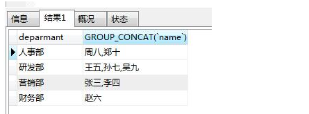

## MySQL  &&  Oracle

### 1.相互关系

```sh
MySQL为Oracle旗下的产品.
使用MySQL时，不同的表还可以使用不同的数据库引擎。如果你不知道应该采用哪种引擎，记住总是选择InnoDB就好了.

MariaDB
由MySQL的创始人创建的一个开源分支版本，使用XtraDB引擎。
Aurora
由Amazon改进的一个MySQL版本，专门提供给在AWS托管MySQL用户，号称5倍的性能提升。
PolarDB
由Alibaba改进的一个MySQL版本，专门提供给在阿里云托管的MySQL用户，号称6倍的性能提升。

在命令提示符下输入mysql -u root -p    密码：sjj123
如果没有启动，进入d盘mysql目录下，bin目录下  net start mysql     #启动mysql服务
再用mysql -u root -p
exit 退出

#postgresql和mysql比较
PostGreSQL具备更高的可靠性，对数据一致性完整性的支持高于MySQL，因此PG更加适合严格的企业应用场景（比如金融、电信、ERP、CRM）；而MySQL查询速度较快，更加适合业务逻辑相对简单、数据可靠性要求较低的互联网场景（比如google、facebook、alibaba）。
```

### 2.主键、外键

```sh
数据库主键，指的是一个列或多列的组合，其值能唯一地标识表中的每一行，通过它可强制表的实体完整性。
主键可以用来表示一个精确定位的特定的行，如果没有主键，你就无法精准定位一条记录是否就是你要的相关行记录，这样就会导致更新或删除表中特定的行很困难。
创建一张含主键的表course
CREATE TABLE course(id INT(11) PRIMARY KEY AUTO_INCREMENT,course_name VARCHAR(30));

外键表示了两个关系之间的相关联系。以另一个关系的外键作主关键字的表被称为主表，具有此外键的表被称为主表的从表。外键又称作外关键字。外键用于与另一张表的关联。是能确定另一张表记录的字段，保持数据的一致性、完整性。
ALTER TABLE students
ADD CONSTRAINT fk_class_id
FOREIGN KEY (class_id)
REFERENCES classes (id);
其中，外键约束的名称fk_class_id可以任意，FOREIGN KEY (class_id)指定了class_id作为外键，REFERENCES classes (id)指定了这个外键将关联到classes表的id列（即classes表的主键）。

要删除一个外键约束，也是通过ALTER TABLE实现的：
ALTER TABLE students
DROP FOREIGN KEY fk_class_id;

#例子
CREATE TABLE tb_name(
  id int NOT NULL AUTO_INCREMENT, # 非空、自增  声明
  name VARCHAR(30) UNIQUE, #添加字段的唯一约束
  update_time TIMESTAMP DEFAULT CURRENT_TIMESTAMP, #设置时间戳默认值为当前时间
  last_updated TIMESTAMP NOT NULL ON UPDATE CURRENT_TIMESTAMP,#设置自动添加更新时间
  size ENUM( 'small', 'medium', 'large') DEFAULT 'small', #枚举类型声明
  PRIMARY KEY (id), #主键声明
  FOREIGN KEY (id) REFERENCES db_name(tb_field) #声明外键
);
```

### 3.索引

```sh
一个索引是存储的表中一个特定列的值数据结构（最常见的是B-Tree）。索引是在表的列上创建。所以，要记住的关键点是索引包含一个表中列的值，并且这些值存储在一个数据结构中。请记住记住这一点：索引是一种数据结构.
B-Tree 是最常用的用于索引的数据结构。因为它们是时间复杂度低， 查找、删除、插入操作都可以可以在对数时间内完成。另外一个重要原因存储在B-Tree中的数据是有序的.
哈希表是另外一种你可能看到用作索引的数据结构-这些索引通常被称为哈希索引。使用哈希索引的原因是，在寻找值时哈希表效率极高.哈希表是无顺的数据结构，对于很多类型的查询语句哈希索引都无能为力。举例来说，假如你想要找出所有小于40岁的员工。你怎么使用使用哈希索引进行查询？这不可行，因为哈希表只适合查询键值对-也就是说查询相等的查询.

数据库索引同时存储了指向表中的相应行的指针。指针是指一块内存区域， 该内存区域记录的是对硬盘上记录的相应行的数据的引用。因此，索引中除了存储列的值，还存储着一个指向在行数据的索引。当这个SQL （SELECT * FROM Employee WHERE Employee_Name = ‘Jesus’ ）运行时，数据库会检查在查询的列上是否有索引。

#在Employee_Name列上创建索引的SQL如下
CREATE INDEX name_index
ON Employee (Employee_Name).

CREATE [索引类型] INDEX 索引名称
ON 表名(列名)

优点：
    1.大大加快数据的检索速度;   
    2.创建唯一性索引，保证数据库表中每一行数据的唯一性;   
    3.加速表和表之间的连接;   
    4.在使用分组和排序子句进行数据检索时，可以显著减少查询中分组和排序的时间。
缺点：
　　1.索引需要占用数据表以外的物理存储空间
　　2.创建索引和维护索引要花费一定的时间
　　3.当对表进行更新操作时，索引需要被重建，这样降低了数据的维护速度。
　　
#哪些场景会使索引失效
1.WHERE 子句中使用 != 或 <> 操作符。如
SELECT id FROM tests WHERE name!='Tony';

2.WHERE 子句中对索引列使用 %前缀模糊查询。
SELECT id FROM tests WHERE name like'%Tony';
//或者 
SELECT id FROM tests WHERE name like'%Tony%';

3.WHERE 子句中对索引列使用 OR 来连接条件。
SELECT id FROM tests WHERE name ='Tony' or id=88;
 
4.WHERE 子句中对索引列使用 NOT IN。 
SELECT id FROM tests WHERE id not in(88,89);
 
5.WHERE 子句中对索引列使用计算、函数、类型转换等操作。 
SELECT id FROM tests WHERE substring(name,1,4)='Tony';
 
6.WHERE 子句中对索引列使用参数。 
SELECT id FROM tests WHERE name=@name;
```

### 4.查询数据

```sh
SELECT * FROM classes;

#条件查询
SELECT * FROM students WHERE score >= 80 AND/OR gender = 'M';
SELECT * FROM students WHERE NOT class_id = 2;  不符合该条件的查询

#排序
SELECT id, name, gender, score FROM students ORDER BY score;       升序
SELECT id, name, gender, score FROM students ORDER BY score DESC;  倒序

#分页查询（mysql分页关键字--limit  oracle分页关键字--rownum）
#mysql
limit m,n 其中m表示起始位置的下标，下标从0开始。n表示要显示的条数，比如要查询一个表的第2到5条数据。
select * from emp limit 1,4;
第一页，每页3行记录：
SELECT id, name, gender, score FROM students ORDER BY score DESC LIMIT 3 OFFSET 0;
第二页：
SELECT id, name, gender, score FROM students ORDER BY score DESC LIMIT 3 OFFSET 3;
在MySQL中，LIMIT 15 OFFSET 30还可以简写成LIMIT 30, 15。使用LIMIT <M> OFFSET <N>分页时，随着N越来越大，查询效率也会越来越低。
#oracle
rownum关键字只能做< <=的判断，不能进行> >=的判断 (把rownum转成一个普通列，然后再利用运算关系计算即可比如查询gcfr_t_vch表的第3到4条数据。)
select * from (select rownum r,t.* from gcfr_t_vch t) tt where tt.r >= 3 and tt.r <= 4;（优先）
或 select * from (select rownum r,t.* from gcfr_t_vch t) tt where tt.r between 3 and 4;
--分页规律总结：每页显示m条数据，查询第n页数据  
 select * from (select rownum r,e. * from 要分页的表 e where rownum<=m*n) t where t.r>m*n-m ;

#聚合查询
SELECT COUNT(*) FROM students;
SUM  计算某一列的合计值，该列必须为数值类型
AVG  计算某一列的平均值，该列必须为数值类型
MAX  计算某一列的最大值
MIN  计算某一列的最小值
SELECT AVG(score) average FROM students WHERE gender = 'M';   其中average为查询列的取别名

#分组
SELECT COUNT(*) num FROM students GROUP BY class_id;

#多表查询
SELECT * FROM students, classes;    SELECT * FROM <表1> <表2>;
SELECT
    students.id sid,
    students.name,
    students.gender,
    students.score,
    classes.id cid,
    classes.name cname
FROM students, classes;

#连接查询
1.内连接
等值连接：指使用等号"="比较两个表的连接列的值，相当于两表执行笛卡尔后，取两表连结列值相等的记录。
语法：
    SELECT 列
    FROM 表1 INNER JOIN 表2
    ON 表1.列 = 表2.列
    
示例：
    SELECT A.*, B.*
    FROM student_info A inner join student_score B
    ON A.student_id = B.student_id

```


非等值连接：指使用大于号">"或小于号"<"比较两个表的连接列的值，相当于两表执行笛卡尔后，取一个表大于或小于另一个表的连结列值的记录。

语法：

    SELECT 列
    FROM 表1 INNER JOIN 表2
    ON 表1.列 <> 表2.列

示例：

    SELECT A.*, B.*
    FROM student_info A inner join student_score B
    ON A.student_id > B.student_id


2.**外连接**

**左外连接（LEFT OUTER JOIN）**：指将左表的所有记录与右表符合条件的记录，返回的结果除内连接的结果，还有左表不符合条件的记录，并在右表相应列中填NULL。

示例：

    SELECT A.*, B.*
    FROM student_info A left join student_score B
    ON A.student_id = B.student_id


**右外连接（RIGHT OUTER JOIN）**：与左外连接相反，指将右表的所有记录与左表符合条件的记录，返回的结果除内连接的结果，还有右表不符合条件的记录，并在左表相应列中填NULL。

示例：

    SELECT A.*, B.*
    FROM student_info A right join student_score B
    ON A.student_id = B.student_id


### 5.其他实用语句

```sh
SHOW DATABASES;

#创建、删除数据库
CREATE DATABASE test;
DROP DATABASE test;

#对一个数据库进行操作时，要首先将其切换为当前数据库：
USE test;

#列出表
SHOW TABLES;

#查看表结构，列出建表语句
DESC students;
SHOW CREATE TABLE students;

#创建、删除表
 CREATE TABLE `students` (
        `id` bigint(20) NOT NULL AUTO_INCREMENT,
        `class_id` bigint(20) NOT NULL,   
        `name` varchar(100) NOT NULL,        
        `gender` varchar(1) NOT NULL,              
        `score` int(11) NOT NULL,               
         PRIMARY KEY (`id`)           
     ) ENGINE=InnoDB AUTO_INCREMENT=1 DEFAULT CHARSET=utf8 

DROP TABLE students;

#如果要给students表新增一列birth
ALTER TABLE students ADD COLUMN birth VARCHAR(10) NOT NULL;
#要修改birth列，例如把列名改为birthday，类型改为VARCHAR(20)
ALTER TABLE students CHANGE COLUMN birth birthday VARCHAR(20) NOT NULL;
#删除列
ALTER TABLE students DROP COLUMN birthday;

#希望插入一条新记录（INSERT），但如果记录已经存在，就先删除原记录，再插入新记录
REPLACE INTO students (id, class_id, name, gender, score) VALUES (1, 1, '小明', 'F', 99);
#希望插入一条新记录（INSERT），但如果记录已经存在，就更新该记录
INSERT INTO students (id, class_id, name, gender, score) VALUES (1, 1, '小明', 'F', 99) ON DUPLICATE KEY UPDATE name='小明', gender='F', score=99;
若id=1的记录不存在，INSERT语句将插入新记录，否则，当前id=1的记录将被更新，更新的字段由UPDATE指定

#若id=1的记录不存在，INSERT语句将插入新记录，否则，不执行任何操作
INSERT IGNORE INTO students (id, class_id, name, gender, score) VALUES (1, 1, '小明', 'F', 99);

#修改数据
UPDATE tb_name SET tb_field1 = 'One', tb_field2 = 'Two' WHERE tb_field3 = '111';

# 删除一个记录
DELETE FROM tb_name WHERE name = 'Bill';
# 删除所有行
DELETE FROM tb_name;
# 删除表
DROP TABLE tb_name;
# 删除数据库
DROP DATABASE db_name;
# 删除索引
ALTER TABLE tb_name DROP INDEX [索引名称];
# 删除列
ALTER TABLE tb_name  DROP COLUMN column_name;

#快照
对class_id=1的记录进行快照，并存储为新表students_of_class1:
CREATE TABLE students_of_class1 SELECT * FROM students WHERE class_id=1;

#union和union all
如果我们需要将两个select语句的结果作为一个整体显示出来，我们就需要用到union或者union all关键字。union(或称为联合)的作用是将多个结果合并在一起显示出来。
union和union all的区别是,union会自动压缩多个结果集合中的重复结果，而union all则将所有的结果全部显示出来，不管是不是重复。
Union因为要进行重复值扫描，所以效率低。如果合并没有刻意要删除重复行，那么就使用Union All。
```

### 6.事务

```sh
这种把多条语句作为一个整体进行操作的功能，被称为数据库事务。数据库事务可以确保该事务范围内的所有操作都可以全部成功或者全部失败。如果事务失败，那么效果就和没有执行这些SQL一样，不会对数据库数据有任何改动。

A：Atomic，原子性，将所有SQL作为原子工作单元执行，要么全部执行，要么全部不执行；
C：Consistent，一致性，事务完成后，所有数据的状态都是一致的，即A账户只要减去了100，B账户则必定加上了100；
I：Isolation，隔离性，如果有多个事务并发执行，每个事务作出的修改必须与其他事务隔离；
D：Duration，持久性，即事务完成后，对数据库数据的修改被持久化存储。

BEGIN;
UPDATE accounts SET balance = balance - 100 WHERE id = 1;
UPDATE accounts SET balance = balance + 100 WHERE id = 2;
COMMIT;
COMMIT是指提交事务，即试图把事务内的所有SQL所做的修改永久保存

希望主动让事务失败，这时，可以用ROLLBACK回滚事务，整个事务会失败
BEGIN;
UPDATE accounts SET balance = balance - 100 WHERE id = 1;
UPDATE accounts SET balance = balance + 100 WHERE id = 2;
ROLLBACK;

#隔离级别
Isolation Level 脏读（Dirty Read）不可重复读（Non Repeatable Read） 幻读（Phantom Read）03
Read Uncommitted   Yes                Yes                       Yes
Read Committed      -                 Yes                       Yes
Repeatable Read     -                  -                        Yes
Serializable        -                  -                         -

Read Uncommitted是隔离级别最低的一种事务级别。在这种隔离级别下，一个事务会读到另一个事务更新后但未提交的数据，如果另一个事务回滚，那么当前事务读到的数据就是脏数据，这就是脏读（Dirty Read）。
Read Committed隔离级别下，不可重复读是指，在一个事务内，多次读同一数据，在这个事务还没有结束时，如果另一个事务恰好修改了这个数据，那么，在第一个事务中，两次读取的数据就可能不一致。
Repeatable Read隔离级别下，幻读（Phantom Read）是指，在一个事务中，第一次查询某条记录，发现没有，但是，当试图更新这条不存在的记录时，竟然能成功，并且，再次读取同一条记录，它就神奇地出现了。(事务A 按照一定条件进行数据读取， 期间事务B 插入了相同搜索条件的新数据，事务A再次按照原先条件进行读取时，发现了事务B 新插入的数据 称为幻读)
Serializable是最严格的隔离级别。在Serializable隔离级别下，所有事务按照次序依次执行，因此，脏读、不可重复读、幻读都不会出现。虽然Serializable隔离级别下的事务具有最高的安全性，但是，由于事务是串行执行，所以效率会大大下降，应用程序的性能会急剧降低。如果没有特别重要的情景，一般都不会使用Serializable隔离级别。

注意：不可重复读与幻读很容易搞混，他们的区别在于：
不可重复读：是同一条记录（一条数据）的内容被其他事物修改了，关注的是update、delete操作一条数据的操作.
幻读：是查询某个范围（多条数据）的数据行变多或变少了，在于insert、delete的操作。

#默认级别
如果没有指定隔离级别，数据库就会使用默认的隔离级别。在MySQL中，如果使用InnoDB，默认的隔离级别是Repeatable Read。

#指定级别的语句
SET TRANSACTION ISOLATION LEVEL READ COMMITTED;
BEGIN;
UPDATE students SET name = 'Bob' WHERE id = 1;
COMMIT;
```


```sh
#查询oracle数据库死锁
SELECT l.session_id sid,
       s.serial#,
       l.locked_mode 锁模式,
       l.oracle_username 登录用户,
       l.os_user_name 登录机器用户名,
       s.machine 机器名,
       s.terminal 终端用户名,
       o.object_name 被锁对象名,
       s.logon_time 登录数据库时间
FROM v$locked_object l, all_objects o, v$session s
WHERE l.object_id = o.object_id
AND l.session_id = s.sid
ORDER BY sid, s.serial#;
```

### 7.oracle中占字节问题

+ **ORACLE中一个字符占多少字节？**

+ **问题描述**

​       或许你会说一个中文字符占2个字节,这是一定的？如何计算一个字符串的字节数？

+ **解决方案**

​        ***在oracle中一个字符特别是中文占几个字节是不同的。***

**例：**比如我创立一个表create table test_ly(a varchar2(4),b nvarchar2(4))

你说a列能插入两个汉字吗？

错！最多能插入一个汉字加一个字母(或数字)。

这是为什么？因为一个汉字在a字段中占了3个字节，其他字符(比如数字或者字母或者英文标点符号)占1个字节，

你说b列最多能插入多少个汉字，2个？

错！b列最多能插入4个汉字，b列的一个汉字或者其他字符(比如数字或者字母或者英文标点符号)占2个字节。

 

**由此可见，N开头的字段类型(比如NCHAR,NVARCHAR2)中，任何一个字符(包括一个汉字)占2个字节，统一的。**

**不以N开头的字段类型(比如CHAR,VARCHAR2)中，unicode字符(比如汉字)占3个字节，其他字符占1个字节。**

```sh
#varchar（10）与nvarchar（10）有什么区别
前者是非unicode型，存储字符按1个算(内部空间存储占1字节)，存储汉字的话按2个算，
就是可以存10个字符或者5个汉字
后者是unicode型，存储什么都是按1个算(内部空间存储占2字节)，
就是可以存10个字符或10个汉字
varchar（10）与nvarchar（10）就是分别占10个字节和20个字节
```

 

+ **如何求一个字符串占用的字符数和字节数？**

Length 函数求得是占用字符数，lengthb或者vsize函数求得是占用字节数。

你说 “中华12” 这个字符串占用了多少字符，字节？看sql返回值便清楚了。

select length('中华12') from dual --返回4，也就是占用4个字符

select lengthb('中华12') from dual --返回8，也就是占用8个字节，其中中华儿子各占3个字节，而12两个字符各占一个字节

select lengthb(N'中华1') from dual --返回6，这是将字符串转换成为unicode字符串后，每个字符占用2个字节，3个就是6个字节

select length(N'中华1') from dual --返回3，因为只有3个字符嘛。

 

**字符串类型字段默认的长度是以字节为单位的，具体取决于参数nls_length_semantics 的值(使用show parameters可以看到这个参数的值)，默认是BYTE，也就是以字节为单位的，如果是CHAR则是以字符为单位的。表的某列可以使用字符为单位吗？当然可以，比如这样创建即可：create table test_ly(a varchar2(4 char)) 这样a列就最多能保存4个字符，而不是4个字节了**


### 8.实战中的sql语句

#### 1.将两条查询语句显示在同一行

1.with

```xml
WITH
        A AS (
        SELECT T1.ACCOUNT_NUM accountNum,T2.NAME oldAccountName,T2.ID_CARD oldIdCard,T2.PHONE oldPhone
        FROM CT_CUST_TRANSFERRECORD T1
        LEFT JOIN CT_CUST_INFO T2 ON T1.OLD_CUST_ID = T2.ID),
        B AS (
        SELECT T1.ACCOUNT_NUM,T2.NAME newAccountName,T2.ID_CARD newIdCard,T2.PHONE newPhone
        FROM CT_CUST_TRANSFERRECORD T1
        LEFT JOIN CT_CUST_INFO T2 ON T1.NEW_CUST_ID = T2.ID)
        SELECT * FROM A,B

这样查询出来的数据会显示重复的多条？是个问题
```

2.关联查询，两次关联同一张表

```xml
SELECT T1.ACCOUNT_NUM accountNum,
        T2.NAME oldAccountName,
        T2.ID_CARD oldIdCard,
        T2.PHONE oldPhone,
        T3.NAME newAccountName,
        T3.ID_CARD newIdCard,
        T3.PHONE newPhone
        FROM CT_CUST_TRANSFERRECORD T1
        LEFT JOIN CT_CUST_INFO T2 ON T1.OLD_CUST_ID = T2.ID
        LEFT JOIN CT_CUST_INFO T3 ON T1.NEW_CUST_ID = T3.ID
```

#### 2.将两个字段显示在一个字段

```sh
sqlserver：
select 发文单位+文号 as 发文单位文号 from table;
 
oracle：
select 发文单位||文号 as 发文单位文号 from table;
select concat(发文单位,文号) as 发文单位文号 from table;
 
mysql：
select concat(发文单位,文号) as 发文单位文号 from table;
```

#### 3.增加表字段语句

```xml
alter table 表明 add column 字段名 varchar(50) DEFAULT NULL COMMENT '备注信息';
```

#### 4.select 1

```sh
1：select  1 from kc     增加临时列，每行的列值是写在select后的数，这条sql语句中是1
2：select count(1)  from kc   不管count(a)的a值如何变化，得出的值总是kc表的行数
3：select sum(1) from kc   计算临时列的和\

1：测试结果，得出一个行数和kc表行数一样的临时列（暂且这么叫，我也不知道该叫什么），每行的列值是1；
2：得出一个数，该数是kc表的行数；
3：得出一个数，该数是kc表的行数；
然后我又用“2”测试，结果如下：
1：得出一个行数和kc表行数一样的临时列，每行的列值是2；
2：得出一个数，该数是kc表的行数；
3：得出一个数，该数是kc表的行数×2的数
然后我又用更大的数测试：
1：得出一个行数和kc表行数一样的临时列，每行的列值是我写在select后的数；
2：还是得出一个数，该数是kc表的行数；
3：得出一个数，该数是table表的行数×写在select后的数
```

#### 5.oracle中merge into用法解析

``` xml
merge into的形式：
MERGE INTO [target-table] A 
USING [source-table sql] B
ON([conditional expression] and [...]...)
WHEN MATCHED THEN
[UPDATE sql]
WHEN NOT MATCHED THEN
[INSERT sql]
作用:判断Ｂ表和Ａ表是否满足ON中条件，如果满足则用B表去更新A表，如果不满足，则将B表数据插入A表但是有很多可选项，如下:
1.正常模式
2.只update或者只insert
3.带条件的update或带条件的insert
4.全插入insert实现
5.带delete的update(觉得可以用3来实现)

传入的是一个id集合
MERGE INTO ss_floor s
        USING (
        <foreach collection="idList" item="id" separator="union all">
            SELECT #{id} AS id FROM dual
        </foreach>
        ) a
        ON ( a.id=s.id)
        WHEN MATCHED THEN
        UPDATE SET NAME = #{buildName},
        FLOORCOUNT = #{floorCount}
        WHEN NOT MATCHED THEN
        INSERT (id,name,remark,addid,addname,adddate,idelete,editid,editname,editdate,floorcount)
        VALUES(#{id},#{buildName},null,0,'sysadmin',SYSDATE,0,0,'sysadmin',SYSDATE,#{floorCount})

传入单个id
MERGE INTO ss_building s
          USING (SELECT #{id} AS id FROM dual) a
          ON ( a.id=s.id)
          WHEN MATCHED THEN
          UPDATE SET NAME = #{buildName},
              FLOORCOUNT = #{floorCount}
          WHEN NOT MATCHED THEN
          INSERT (id,name,remark,addid,addname,adddate,idelete,editid,editname,editdate,floorcount)
          VALUES(#{id},#{buildName},null,0,'sysadmin',SYSDATE,0,0,'sysadmin',SYSDATE,#{floorCount})

```

#### 6.数据库触发器

```xml
语法： 
CREATE
    TRIGGER `jony_keer`.`ins_account` AFTER INSERT
    ON `jony_keer`.`t_account`
    FOR EACH ROW BEGIN
    INSERT INTO `t_user`(`userid`,`cellphone`,`account_psd`)  VALUES  (new.`account_id`,new.`cellphone`,new.`account_psd`);
    END$$


TRIGGER  触发器
`jony_keer`.`ins_account` 触发器名称   jony_keer是我的数据库名字  ins_account 才是实际的触发器名称
AFTER 表示 执行条件，有 BEFORE（之前 ） AFTER（之后）
INSERT ON 表示在执行了 插入操作  ,有INSERT/UPDATE/DELETE 三种 
`jony_keer`.`t_account` 接下来的这个是表示触发器所在的表（可以理解为 触发器在t_account 表插入一组出具后执行）
FOR EACH ROW BEGIN  固定用法  后面跟你要做的事情例如我要做的事情是在t_user表中插入
`userid`,`cellphone`,`account_psd` 三个记录
INSERT INTO `t_user`(`userid`,`cellphone`,`account_psd`)  VALUES  (new.`account_id`,new.`cellphone`,new.`account_psd`);
new 其实就是t_account 表中插入的数据  我们把 t_account 表中插入的  account_id  cellphone account_psd 赋值给t_user表中的 userid  cellphone account_psd

```

#### 7.查询数据库版本

```xml
SELECT * FROM  V$VERSION;
```

#### 8.mysql有则更新，无则插入

```xml
INSERT INTO p_access_record  (id,area_name,dev_name,record_time,create_time,card_no,open_type,direction,appoint_id)
    VALUES (#{accessExternalRecordDto.id},
    #{accessExternalRecordDto.areaName},
    #{accessExternalRecordDto.devName},
    str_to_date(#{accessExternalRecordDto.recordTime},'%Y-%m-%d %H:%i:%s'),
    current_timestamp,
    #{accessExternalRecordDto.cardNo},
    #{accessExternalRecordDto.type},
    #{accessExternalRecordDto.direction},
    #{accessExternalRecordDto.appointId}
    )
    ON DUPLICATE KEY UPDATE update_time=current_timestamp;

on duplicate key update
当primary或者unique重复时，则执行update语句
```

#### 9.mysql和oracle 分组，展示多个字段

```xml
<!--mysql-->
SQL分组查询GroupBy+Group_concat ---表示分组之后，根据分组结果，使用 group_contact() 来放置每一组的每字段的值的集合
select deparmant, GROUP_CONCAT(`name`) from employee GROUP BY deparmant
```



```xml
<!--oracle-->
所有版本的oracle都可以使用select wm_concat(name) as name from user;
但如果是oracle11g，使用select listagg(name, ',') within group( order by name) as name from user;
效率更高，官方也更推荐这种写法。

注意：wm_concat 运行后的返回结果根据oracle的版本不同而会字段类型不同，在oracle11g中返回clob型，在oracle10g中返回varchar型

通用版本语句：select qlrid,to_char(wm_concat(qlr)) as qlr,to_char(wm_concat(qlrzjh)) as qlrzjh from qlr t group by qlrid;

例：
<select id="getAccessCustGroupWholeList" resultType="com.access.api.model.AccessCustGroupWholeDto">
        select
        to_char(wm_concat(d.GROUPCODE)) as groupid_arr,
        p.CUSTOMERCARDCODE as cust_code
        from DR_LIMIT_GROUP_CUST d
        left join pc_customer_base p on d.CUSTOMERID = p.ID
        where d.ver > #{ver} and d.ver <![CDATA[ <= ]]> #{maxVer}
        group by p.CUSTOMERCARDCODE
    </select>

<!--使用wm_concat效率明显低于listagg函数，建议使用listagg替代wm_concat，但使用listagg函数注意，拼接的字符不超过4000字节-->
 SELECT
  listagg( d.GROUPCODE,',') within group(order by d.GROUPCODE)  AS groupid_arr,
  p.CUSTOMERCARDCODE AS cust_code
FROM
  DR_LIMIT_GROUP_CUST d
  LEFT JOIN pc_customer_base p ON d.CUSTOMERID = p.ID 
WHERE
  d.ver > 0 
  AND d.ver <= 4528372 
GROUP BY
  p.CUSTOMERCARDCODE                    
```

#### 10.plsql修改数据

```sh
select t.*, t.rowid from SS_FLOOR t where t.buildingid=8
```


### 9.sql优化

```sh
1、查询语句中不要使用select *
https://blog.csdn.net/androidstarjack/article/details/116473893
2、尽量减少子查询，使用关联查询（left join,right join,inner join）替代
子查询就更别用了，效率太差，执行子查询时，MYSQL需要创建临时表，查询完毕后再删除这些临时表，所以，子查询的速度会受到一定的影响，这里多了一个创建和销毁临时表的过程
3、减少使用IN或者NOT IN ,使用exists，not exists或者关联查询语句替代
4、or 的查询尽量用 union或者union all 代替(在确认没有重复数据或者不用剔除重复数据时，
union all会更好) 5、应尽量避免在 where 子句中使用!=或<>操作符，否则将引擎放弃使用索引而进行全表扫描。
6、应尽量避免在 where 子句中对字段进行 null 值判断，否则将导致引擎放弃使用索引而进行全表
扫描，如： select id from t where num is null 可以在num上设置默认值0，确保表中num列没有
null值，然后这样查询： select id from t where num=0
```

**1.like语句优化**

```
SELECT id FROM A WHERE name like '%abc%'
```

 由于abc前面用了“%”，因此该查询必然走全表查询，除非必要，否则不要在关键词前加%，优化成如下

```
SELECT id FROM A WHERE name like 'abc%'
```

**2.where子句使用 ！= 或 <> 操作符优化**

在where子句中使用 ！= 或 <>操作符，索引将被放弃使用，会进行全表查询。

如SQL:SELECT id FROM A WHERE ID != 5 优化成：SELECT id FROM A WHERE ID>5 OR ID<5

**3.where子句使用or的优化**

　　很多时候使用union all 或 nuin(必要的时候)的方式替换“or”会得到更好的效果。where子句中使用了or,索引将被放弃使用。

```xml
如SQL:    SELECT id FROM A WHERE num =10 or num = 20 
优化成：   SELECT id FROM A WHERE num = 10 union all SELECT id FROM A WHERE num=20
```

**4.where子句使用IN 或 NOT IN的优化**　　

```sh
in和not in 也要慎用，否则也会导致全表扫描。
方案一：between替换in
如SQL:SELECT id FROM A WHERE num in(1,2,3) 优化成：SELECT id FROM A WHERE num between 1 and 3
方案二：exist替换in
如SQL:SELECT id FROM A WHERE num in(select num from b ) 
优化成：SELECT num FROM A WHERE num exists(select 1 from B where B.num = A.num)
方案三：left join替换in
如SQL:SELECT id FROM A WHERE num in(select num from B) 优化成：SELECT id FROM A LEFT JOIN B ON A.num = B.num

https://www.cnblogs.com/clarke157/p/7912871.html
1. in()适合B表比A表数据小的情况
2. exists()适合B表比A表数据大的情况
当A表数据与B表数据一样大时,in与exists效率差不多,可任选一个使用.
select * from A
where id in(select id from B)
如:A表有10000条记录,B表有1000000条记录,那么最多有可能遍历10000*1000000次,效率很差.
再如:A表有10000条记录,B表有100条记录,那么最多有可能遍历10000*100次,遍历次数大大减少,效率大大提升.
select a.* from A a 
where exists(select 1 from B b where a.id=b.id)
如:A表有10000条记录,B表有1000000条记录,那么exists()会执行10000次去判断A表中的id是否与B表中的id相等.
如:A表有10000条记录,B表有100000000条记录,那么exists()还是执行10000次,因为它只执行A.length次,可见B表数据越多,越适合exists()发挥效果.

#exists用法
exists : 强调的是是否返回结果集，不要求知道返回什么, 比如：select name from student where sex = 'm' and mark exists(select 1 from grade where ...) ,只要exists引导的子句有结果集返回，那么exists这个条件就算成立了,大家注意返回的字段始终为1，如果改成“select 2 from grade where ...”，那么返回的字段就是2，这个数字没有意义。所以exists子句不在乎返回什么，而是在乎是不是有结果集返回。
```


```sh
#sql优化实例
原sql:
<select id="getAceCustAuth" resultType="com.ets.ecard.dto.access.AceCustAuthDto">
        SELECT
        T1.BEGIN_TIME beginTime,
        T1.END_TIME endTime,
        T1.TYPE type,
        T2.WORK_NO workNo,
        T2.NAME name,
        T3.NAME custPlan,
        T4.NAME devName,
        T5.NAME deptName,
        T6.NAME ssName
        FROM
        ACE_CUST_AUTH T1
        LEFT JOIN CT_CUST_INFO T2 ON T1.CUST_CODE = T2.CUST_CODE
        LEFT JOIN ACE_CUST_PLAN T3 ON T1.PLAN_ID = T3.ID
        LEFT JOIN DV_DEV_INFO T4 ON T1.DEV_ID = T4.ID
        LEFT JOIN DV_DEV_DEPT T5 ON T4.DEV_DEPT_ID = T5.ID
        LEFT JOIN SS_MANAGER_INFO T6 ON T1.OP_ID = T6.ID
        LEFT JOIN CT_CUST_DEPT T7 ON T2.DEPT_ID = T7.ID
        WHERE
        T1.TYPE = 1
        <if test="legalPersonCode != null and legalPersonCode !=''">
            AND T1.LEGAL_PERSON_CODE = #{legalPersonCode}
        </if>
        <if test="deptCode != null and deptCode !=''">
            AND T5.DEPT_CODE LIKE #{deptCode}||'%'
        </if>
        <if test="deptmCode != null and deptmCode !=''">
            AND T7.DEPT_CODE LIKE #{deptmCode}||'%'
        </if>
        <if test="name != null and name !=''">
            AND (T2.NAME LIKE '%'||#{name}||'%' OR T2.WORK_NO LIKE '%'||#{name}||'%')
        </if>
        <if test="devName != null and devName !=''">
            AND T4.NAME LIKE '%'||#{devName}||'%'
        </if>
        <if test="deptName != null and deptName !=''">
            AND T5.NAME LIKE '%'||#{deptName}||'%'
        </if>
        ORDER BY T1.CREATE_TIME DESC
    </select>
    
优化后sql:
<select id="getAceCustAuth" resultType="com.ets.ecard.dto.access.AceCustAuthDto">
        SELECT
        T1.BEGIN_TIME beginTime,
        T1.END_TIME endTime,
        T1.TYPE type,
        T2.WORK_NO workNo,
        T2.NAME name,
        T3.NAME custPlan,
        T4.NAME devName,
        T5.NAME deptName,
        T6.NAME ssName
        FROM
        (SELECT * FROM ACE_CUST_AUTH WHERE ACE_CUST_AUTH.LEGAL_PERSON_CODE = #{legalPersonCode}) T1
        LEFT JOIN CT_CUST_INFO T2 ON T1.CUST_CODE = T2.CUST_CODE
        LEFT JOIN ACE_CUST_PLAN T3 ON T1.PLAN_ID = T3.ID
        LEFT JOIN DV_DEV_INFO T4 ON T1.DEV_ID = T4.ID
        LEFT JOIN DV_DEV_DEPT T5 ON T4.DEV_DEPT_ID = T5.ID
        LEFT JOIN SS_MANAGER_INFO T6 ON T1.OP_ID = T6.ID
        LEFT JOIN CT_CUST_DEPT T7 ON T2.DEPT_ID = T7.ID
        WHERE
        T1.TYPE = 1
        <if test="deptCode != null and deptCode !=''">
            AND T5.DEPT_CODE LIKE #{deptCode}||'%'
        </if>
        <if test="deptmCode != null and deptmCode !=''">
            AND T7.DEPT_CODE LIKE #{deptmCode}||'%'
        </if>
        <if test="name != null and name !=''">
            AND  T2.ID IN (SELECT ID FROM CT_CUST_INFO WHERE (CT_CUST_INFO.NAME LIKE  '%' || #{name} || '%' OR
            CT_CUST_INFO.WORK_NO LIKE '%' || #{name} || '%'))
        </if>
        <if test="devName != null and devName !=''">
            AND T4.ID IN (SELECT ID FROM DV_DEV_INFO WHERE DV_DEV_INFO.NAME LIKE '%' || #{devName} || '%')
        </if>
        <if test="deptName != null and deptName !=''">
            AND T5.ID IN (SELECT ID FROM DV_DEV_DEPT WHERE DV_DEV_DEPT.NAME LIKE '%' || #{deptName} || '%')
        </if>
        ORDER BY T1.CREATE_TIME DESC
    </select>
----用子查询代替全表查主表
```

```sh
#哪些场景会使索引失效
1.条件中用or，即使其中有条件带索引，也不会使用索引查询
2.like的模糊查询以%开头，索引失效
3.如果列类型是字符串，那一定要在条件中将数据使用引号引用起来，否则不会使用索引
```

### 10.xml中CDATA标签的用法

```sh
术语 CDATA 指的是不应由 XML 解析器进行解析的文本数据（Unparsed Character Data）。
在 XML 元素中，"<" 和 "&" 是非法的
"<" 会产生错误，因为解析器会把该字符解释为新元素的开始。
"&" 也会产生错误，因为解析器会把该字符解释为字符实体的开始。
某些文本，比如 JavaScript 代码，包含大量 "<" 或 "&" 字符。为了避免错误，可以将脚本代码定义为 CDATA。
CDATA 部分中的所有内容都会被解析器忽略。
CDATA 部分由 "<![CDATA[" 开始，由 "]]>" 结束：

例：WHERE Auth.Plan_Id<![CDATA[ <> ]]>#{planId}
```

### 11.oracle 视图与物化视图

```sh
#查看视图
select * from user_views;  --查看普通视图

select * from user_mviews;  --查看物化视图
select count(*) from user_mviews where mview_name = 'GROUP_CUST'
#删除视图
drop view GROUP_CUST  --删除视图
drop materialized view GROUP_CUST  --删除物化视图

#创建物化视图
https://www.jianshu.com/p/a06b3436f5ed

DECLARE
  v_sql   VARCHAR2(2000);
  v_count number;
BEGIN
Select Count(*)
  Into v_count
  from user_mviews where mview_name = 'GROUP_CUST';
If (v_count = 0)
Then
  v_sql := 'create materialized view group_cust as SELECT
  listagg( d.GROUPCODE,'','') within group(order by d.GROUPCODE) AS groupid_arr,
  p.CUSTOMERCARDCODE AS cust_code ,
  max(d.ver) ver
FROM
  DR_LIMIT_GROUP_CUST d, pc_customer_base p where d.CUSTOMERID = p.ID(+)
GROUP BY
  p.CUSTOMERCARDCODE';
  Execute Immediate v_sql;
End If;
end;
/
--此处左连接必须这么写，不然刷新不了物化视图

#创建刷新物化视图的存储过程
CREATE OR REPLACE PROCEDURE auto_refresh_mview_job_proc
AS
BEGIN
dbms_mview.REFRESH('group_cust');
END;
/

#创建定时刷新job
DECLARE
  v_sql   VARCHAR2(2000);
  v_count number;
BEGIN
Select Count(*)
  Into v_count
  from dba_SCHEDULER_jobs where job_name = 'AUOT_REFRESH_MVIEW_JOB';
If (v_count = 1)
Then
  v_sql := 'begin dbms_scheduler.drop_job(''auot_refresh_mview_job'');end;';
  Execute Immediate v_sql;
End If;
end;
/

BEGIN
DBMS_SCHEDULER.CREATE_JOB(
job_name => 'auot_refresh_mview_job',
job_type => 'STORED_PROCEDURE',
job_action => 'auto_refresh_mview_job_proc',
start_date => SYSDATE,
repeat_interval => 'FREQ=DAILY;INTERVAL=1; BYHOUR=23;byminute=00',
enabled => TRUE,
comments => 'Refresh materialized view mv_emp'
);
END;
/
--每天23点刷新
https://blog.csdn.net/li19236/article/details/41486177
https://my.oschina.net/naisitumitiu/blog/4271719
https://blog.csdn.net/demonson/article/details/81392306

#删除job
begin
dbms_scheduler.drop_job('auot_refresh_mview_job');
end;
#停止job
begin
  dbms_scheduler.stop_job('auot_refresh_mview_job');
end ;
#查询job执行时间和上一次执行时间
select last_start_date,next_run_date from dba_SCHEDULER_jobs where job_name = 'AUOT_REFRESH_MVIEW_JOB';
Select * from dba_scheduler_jobs;

#手动执行存储过程
begin
auto_refresh_mview_job_proc;
end;
```

### 12.聚簇索引与非聚簇索引

**什么是聚簇索引（clustered index ）和非 聚簇索引（non-clustered index ）？**

从物理存储角度 来分， 索引 可以 分为聚簇索引和非聚簇索引 ， 区别主要看叶子节点存了什么数据 。

在InnoDB 里，索引 B+Tree 的叶子节点存储了整行数据的是主键索引，也被称之为聚簇索引。聚簇索引是对磁盘上实际数据重新组织以按指定的一个或多个列的值排序的算法。特点是存储数据的顺序和索引顺序一致。一般情况下主键会默认创建聚簇索引，且一张表只允许存在一个聚簇索引 ， 因为 数据一旦存储，顺序只能有一种。找到了索引就找到了需要的数据，那么这个索引就是聚簇索引，所以主键就是聚簇索引，修改聚簇索引其实就是修改主键。

索引B+Tree 的叶子节点 只 存储了主键的值 和索引列 的是非主键索引，也被称之为非聚簇索引。一个表可以有多个非聚簇索引 。 非聚簇 索引的存储和数据的存储是分离的，也就是说 可能 找到了索引但没找到数据，需要根据索引上的值（主键）再次回表查询，非聚簇索引也叫做辅助索引。

聚簇索引的叶子节点就是数据节点，而非聚簇索引的叶子节点仍然是索引节点，只不过有指向对应数据块的指针。

聚簇索引查询相对会更快一些，因为主键索引树的叶子节点直接就是我们要查询的整行数据了 ， 而非主键索引的叶子节点是主键的值，查到主键的值以后，还需要再通过主键的值再进行一次查询（这个过程叫做回表 ， 也就是查了2 个索引树）。

例如， 下面 的SQL 创建了一个学生表 ：

```
create table lhrdb.student (``  ``id` `bigint,``  ``no varchar(20) ,``  ``name varchar(20) ,``  ``address varchar(20) ,``  ``PRIMARY KEY (```id```),``  ``UNIQUE KEY `idx_no` (`no`)``)ENGINE=InnoDB DEFAULT CHARSET=utf8mb4;
```

对于如下的SQL 语句， 直接根据主键查询 获取 所有字段数据，此时主键 是 聚簇索引，因为主键对应的索引叶子节点存储了id=1 的所有字段的值 ：

```
select` `* from lhrdb.student where ``id` `= 1;
```

对于如下的SQL 语句， 根据编号 no 查询编号和名称，编号本身是一个唯一索引，但查询的列包含了学生编号和学生名称，当命中编号索引时，该索引的节点的数据存储的是主键ID ，需要根据主键 ID 重新查询一次，所以这种查询下 no 不是聚簇索引 ：

```
select` `no,name from student where no = ``'test'``;
```

对于如下的SQL 语句， 根据编号查询编号，这种查询命中编号索引时，直接返回编号，因为所需要的数据就是该索引，不需要回表查询，这种场景下no 是聚簇索引

```
select` `no from student where no = ``'test'``;
```

主键一定是聚簇索引， 如果开发 人员不手动设置 主键 ， 那么MySQL 会 默认 使用 非空的 Unique 索引， 若 没有 非空的 Unique 索引，则会使用数据库内部的一个行的 id 来当作主键索引 ， 其它普通索引需要区分SQL 场景，当 SQL 查询的列就是索引本身时，我们称这种场景下该普通索引也可以叫做聚簇索引， MyisAM 引擎没有聚簇索引。

### 13.B+树结构

见印象笔记中微信保存列表中文章