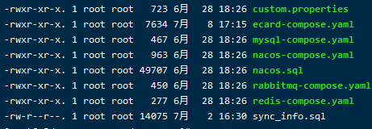

# docker

jiajundocker      sjiaj1995@163.com   默认密码

https://hub.docker.com/editions/community/docker-ce-desktop-windows下载edge版docker desktop

 docker Go语言

 解决了运行环境和配置问题软件容器，方便做持续集成并有助于整体发布的容器虚拟化技术。

传统的虚拟机技术是虚拟出一套硬件后，在其上运行一个完整的操作系统，在该操作系统上运行相应进程。

容器内的应用进程直接运行于宿主机的内核（硬盘、cd、声卡、显示器等等），容器内没有自己的内核而且没有进行硬件虚拟。每个容器相互隔离。每个容器有自己的文件系统，容器之间进程不会相互影响，能区分计算。 

docker本身是一个容器运行载体或者称之为管理引擎。我们把应用程序和配置依赖打包好形成一个可交付的运行环境，这个打包好的运行环境就是image镜像文件。只有通过这个镜像文件才能生成Docker容器。image文件可以看作是容器的模板。Docker根据image文件生成容器的实例。同一个image文件，可以生成多个同时运行的容器实例。

三要素：镜像(image)，容器(container)，仓库(repository)。

镜像就是一个只读模板，镜像可以用来创建 Docker 容器，一个镜像可以创建很多个容器。

容器是用镜像创建的运行实例。

仓库是集中存放镜像文件的场所。


阿里云镜像加速 https://dev.aliyun.com/search.html

VM 分钟级, Docker 秒级。

帮助命令 ：
docker version 
docker info
docker --help

镜像命令：

```)
docker images 列出本机上的镜像  （-a 列出全部  -q只显示镜像id  --digests显示镜像摘要信息  --no-trunc显示完整镜像信息）
docker search 名字    是在dockerhub上查 
docker pull 名字    docker pull 名字：5.6 -->带版本的镜像
docker rmi 名字/或id      删除image  如果已经创了容器则： docker rmi -f 名字/id       删除全部image   docker rmi -f $(docker images -qa)
```

容器命令：

```)
docker run -it 名字/id  --name  新名字                     启动交互式容器，即进入容器中
docker run -it -p 8080:8080 tomcat   -p主机端口（对外暴露的端口）：docker容器端口（内部实际的端口）  -P随机分配端口  docker run -it -P tomcat
docker ps    查看有哪些正在进行的容器（-l 上一次运行的     -a   所有的    -n  数字    上几个容器）
exit   容器停止退出     或   ctl+ p+q   容器不停止退出
docker start 名字或id
docker restart名字或id
docker stop 名字或id(温柔删除)     docker kill 名字或id(强制删除)
docker rm 名字或id            删除多个docker rm -f $(docker ps -qa)     /docker ps -aq | xargs docker rm

docker run -d 名字或id     后台启动(要通过exec进入)
docker logs -ft --tail 数字 容器id（ 查看容器log    t加入时间戳  f跟随最新的日志打印   --tail 数字 显示最后多少条）
docker exec -it 名字或id ls -l /tmp   在容器中打开新的终端，并可以启动新的进程
(docker exec -it openstack-pythonAPI-test bash)
docker attach 名字或id   重新进入容器中,不会启动新的进程
docker cp 容器id:/tmp/yum.log /root               从容器内拷贝数据到主机上

容器停止退出，命令：exit
容器不停止退出，命令：ctrl+P+Q
```


docker镜像是一种轻量级、可执行的独立软件包，用来打包软件运行环境和基于运行环境开发的软件，它包含运行某个软件所需要的所有内容，包括代码、运行时、库、环境变量和配置文件。

```)
docker commit 提交容器副本使之成为一个新的镜像
docker commit -m="提交的描述信息" -a="作者"   容器id 要创建的目标镜像名
```


docker容器数据卷：1.数据卷可在容器之间共享或重用数据 2.卷中的更改可以直接生效 3.数据卷中的更改不会包含在镜像的更新中 4.数据卷的生命周期一直持续到没有容器使用它为止。
容器内添加：直接添加   DockerFile

直接添加：
命令  docker run -it -v /宿主机绝对路径目录：/容器内的目录  镜像名
查看数据卷是否挂载成功 docker inspect id
容器和宿主机之间数据共享
容器停止退出后，主机修改后数据是否同步
命令（带权限）docker run -it -v /宿主机绝对路径目录：/容器内的目录:ro  镜像名

DockerFile添加：
1.手动编写DockerFile文件，符合file规范
2.有这个文件后，直接docker build命令执行，获得一个自定义的镜像(docker build -f /dockerfile路径 -t  新镜像名字 .)
3.run

DockerFile 是用来构建Docker镜像的构建文件，是由一系列命令和参数构成的脚本。

https://hub.docker.com

DockerFile体系结构：
FROM  基础镜像，当前新镜像是基于哪个镜像的
MAINTAINER  镜像维护者的姓名和邮箱地址
RUN   容器构建时需要运行的命令
EXPOSE    当前容器对外暴露出的端口
WORKDIR   指定在创建容器后，终端默认登陆的进来工作目录，一个落脚点
ENV   用来在构建镜像过程中设置环境变量
ADD  将宿主机目录下的文件拷贝进镜像且ADD命令会自动处理url和解压tar压缩包
COPY  类似ADD，拷贝文件和目录到镜像中，将从构建上下文目录中的文件/目录复制到新的一层镜像内的位置
VOLUME 容器数据卷，用于数据保存和持久化工作
CMD  指定一个容器启动时要运行的命令,可以有多个cmd,但只有最后一个生效，会被docker run 后的参数替代
ENTRYPOINT 指定一个容器启动时要运行的命令，docker run 后的参数追加的形式
ONBUILD  当构建一个被继承的DockerFile时运行命令，父镜像在被 子继承后父镜像的onbuild被触发。

官网centos样本:
FROM scratch
MAINTAINER The CentOS Project <cloud-ops@centos.org>
ADD c68-docker.tar.xz /
LABEL name="CentOS Base Image" \
​       vendor="CentOS" \
​       license="GPLv2" \
​       build-date="2016-06-02"
#Default command
CMD ["/bin/bash"]          CMD ["/bin/bash"] json串格式 =CMD /bin/bash

案例一：
FROM centos
MAINTAINER jiajun

ENV MYPATH /tmp
WORKDIR $MYPATH

RUN yum -y install vim 
RUN yum -y install net-tools                   （能使用ifconfig等命令）

EXPOSE 80
CMD echo $MYPATH
CMD echo "success----------------ok"
CMD /bin/bash


docker build -f /dockerfile路径 -t  新镜像名字 .              .为当前目录
docker history id/名字   列出镜像的变更历史


本地镜像发布到阿里云上：

 docker login --username= registry.cn-hangzhou.aliyuncs.com

docker tag 镜像id registry.cn-hangzhou.aliyuncs.com/zzyybuy/mycentos:版本号

docker push registry.cn-hangzhou.aliyuncs.com/zzyybuy/mycentos:版本号


#### docker --link

运行一个容器,通过–name指定一个便于记忆的名字,这个容器被称为source container，也就是要连接的容器
$ docker run --name mysql -e MYSQL_ROOT_PASSWORD=server -d mysql

上面通过传递环境变量MYSQL_ROOT_PASSWORD=server，来设置MySQL服务的密码为server

 运行另外一个容器，并link到上面启动的容器，这个容器被称为received container
$ docker run --name nginx --link mysql:aliasmysql -d nginx

 上面通过–link连接名为db的容器，并为其设置了别名aliasmysql。

 完成了上面的两个步骤后，在nginx的容器中就可以使用db或者aliasmysql作为连接地址来连接MySQL服务，即使容器重启了，地址发生了变化，不会影响两个容器之间的连接。

源容器和接收容器之间传递数据是通过以下2种方式：

- 设置环境变量
- 更新/etc/hosts文件

使用了link机制后，可以通过指定的名字来和目标容器通信，这其实是通过给/etc/hosts中加入名称和IP的解析关系来实现的.


就在Docker容器技术被炒得热火朝天之时，大家发现，如果想要将Docker应用于具体的业务实现，是存在困难的——编排、管理和调度等各个方面，都不容易。于是，人们迫切需要一套管理系统，对Docker及容器进行更高级更灵活的管理。 

就在这个时候，K8S出现了。

**K8S，就是基于容器的集群管理平台，它的全称，是kubernetes。**

```sh
#安装edge版的docker desktop
https://hub.docker.com/editions/community/docker-ce-desktop-windows
#启动配置
settings: 
  Advance cpu-->6   memory-->10240MB
  Kubernetes 勾选1，3
  General 勾选Expose daemon on tcp://localhost:2375 without TLS勾了这个wsl才能访问

$ docker --version
Docker version 19.03.0-rc2, build f97efcc

$ kubectl get node
NAME             STATUS   ROLES    AGE   VERSION
docker-desktop   Ready    master   17m   v1.14.3

#WSL(Microsoft-Windows-Subsystem-Linux)安装docker
$ sudo apt-get update
$ sudo apt-get install apt-transport-https ca-certificates curl gnupg2 lsb-release \software-properties-common
$ curl -fsSL https://mirrors.ustc.edu.cn/docker-ce/linux/debian/gpg | sudo apt-key add -
$ sudo add-apt-repository \
   "deb [arch=amd64] https://mirrors.ustc.edu.cn/docker-ce/linux/debian \
   $(lsb_release -cs) \
   stable"
$ sudo apt-get update
$ sudo apt-get install docker-ce
service docker start
在root目录下新建.bash_profile
echo "export DOCKER_HOST=localhost:2375" >> .bash_profile 
source .bash_profile

#WSL安装kubectl
https://devkimchi.com/2018/06/05/running-kubernetes-on-wsl/

curl -LO https://storage.googleapis.com/kubernetes-release/release/$(curl -s https://storage.googleapis.com/kubernetes-release/release/stable.txt)/bin/linux/amd64/kubectl \
&& chmod +x ./kubectl \
&& sudo mv ./kubectl /usr/local/bin/kubectl
kubectl 已安装然后在root目录下新建文件夹
mkdir ~/.kube && cp /mnt/c/Users/xxxxxx/.kube/config ~/.kube
kubectl config use-context docker-for-desktop
kubectl version

#WSL安装helm
curl https://raw.githubusercontent.com/kubernetes/helm/master/scripts/get > get_helm.sh
chmod 700 get_helm.sh
./get_helm.sh
helm init

#kubernetes命令
kubectl get node
kubectl get pod

#安装mc
进入XXXX_tools目录
helm install XXXXXX
helm list
helm delete <list查询出的>

kubectl exec -it test-agent bash  进入节点
```


kubernetes是管理container的工具，openstack是管理VM的工具。

container可以运行在物理机上，也可以运行在VM上。所以kubernetes不是需要openstack的支持。但对于云计算来说，很多IasS都通过openstack来管理虚拟机。然后用户可以在这些虚拟机上运行docker，可以通过kubernetes进行管理。

OpenStack定位为 数据中心操作系统，面向基础设施资源，OpenStack不仅仅管理计算资源，还包括网络，存储资源的自动管理。

OpenStack = 计算资源管理（主要最成熟的是虚机） + 存储资源管理 + 网络资源管理

Kubernetes定位为基于容器的集群管理系统，直接面向cloudnative应用：

Kubernetes = 容器资源管理 + 集群编排





```sh
#操作命令
docker-compose -f ecard-compose.yaml up -d            -----启动服务
docker-compose -f nacos-compose.yaml up -d            -----启动nacos
docker-compose -f ecard-compose.yaml restart 容器名    -----重启某个服务
docker-compose -f nacos-compose.yaml down

docker-compose -f ecard-compose.yaml stop ecard-consumer-accessinterface
docker-compose -f ecard-compose.yaml rm ecard-consumer-accessinterface
docker-compose -f ecard-compose.yaml up -d ecard-consumer-accessinterface
```

```sh
#安装activemq
docker search activemq
docker pull webcenter/activemq
docker images
docker run -d --name activemq -p 8161:8161  -p 61613:61613 -p 1883:1883 -p 61616:61616 webcenter/activemq
（1883为mqtt端口，8161是后台管理系统，61616是给java用的tcp端口）
```

```sh
#如果安装docker镜像时速度很慢，修改下载地址
设置docker拉取镜像加速
需要修改配置文件，Docker 使用 /etc/docker/daemon.json来配置daemon。
vi /etc/docker/daemon.json
在配置文件中加入
{
"registry-mirrors": ["http://hub-mirror.c.163.com"]
}
systemctl restart docker
```

```sh
#删除images
docker rmi -f registry.cn-shanghai.aliyuncs.com/ecard/consumer-kernel-gateway:1.2.1-20200831-5
docker rmi -f registry.cn-shanghai.aliyuncs.com/ecard/consumer-cloudapi:1.2.1-20200831-5
docker rmi -f registry.cn-shanghai.aliyuncs.com/ecard/consumer-center:1.2.1-20200831-5
docker rmi -f registry.cn-shanghai.aliyuncs.com/ecard/provider-monitor:1.2.1-20200831-5
docker rmi -f registry.cn-shanghai.aliyuncs.com/ecard/provider-oauth:1.2.1-20200831-5
docker rmi -f registry.cn-shanghai.aliyuncs.com/ecard/consumer-web:1.2.1-20200831-5
docker rmi -f registry.cn-shanghai.aliyuncs.com/ecard/provider-kernel:1.2.1-20200831-5
docker rmi -f registry.cn-shanghai.aliyuncs.com/ecard/base-service:1.2.1-20200831-5
docker rmi -f registry.cn-shanghai.aliyuncs.com/ecard/consumer-interface:1.2.1-20200831-5
docker rmi -f registry.cn-shanghai.aliyuncs.com/ecard/ecard-consumer-accessinterface:1.2.1-20200831-5
docker rmi -f registry.cn-shanghai.aliyuncs.com/ecard/provider-log-service:1.2.1-20200831-5
docker rmi -f registry.cn-shanghai.aliyuncs.com/ecard/consumer-self-service:1.2.1-20200831-5
docker rmi -f registry.cn-shanghai.aliyuncs.com/ecard/ecard-consumer-studentweb:1.2.1-20200831-5
docker rmi -f registry.cn-shanghai.aliyuncs.com/ecard/ecard-consumer-wisedu:1.2.1-20200831-5
docker rmi -f registry.cn-shanghai.aliyuncs.com/ecard/provider-report:1.2.1-20200831-5
docker rmi -f registry.cn-shanghai.aliyuncs.com/ecard/ecard-consumer-accessweb:1.2.1-20200831-5
docker rmi -f registry.cn-shanghai.aliyuncs.com/ecard/ecard-provider-sync-third-mysql:1.2.1-20200831-5
docker rmi -f registry.cn-shanghai.aliyuncs.com/ecard/ecard-consumer-manageweb:1.2.1-20200831-5

-------------------------------------------------------------------------------------
#停容器
docker stop ecard-consumer-cloudapi ecard-consumer-interface ecard-consumer-accessinterface ecard-consumer-accessweb ecard-consumer-manageweb ecard-provider-sync-third-mysql ecard-consumer-self-service ecard-provider-monitor ecard-provider-oauth ecard-provider-kernel ecard-base-service ecard-consumer-wisedu ecard-provider-log ecard-consumer-web ecard-consumer-kernel-gateway ecard-provider-report ecard-consumer-center ecard-consumer-studentweb

sudo docker stop/start $(docker ps -a | awk ‘{ print $1}’ | tail -n +2)
杀死所有正在运行的容器
docker kill $(docker ps -a -q)
删除所有已经停止的容器
docker rm $(docker ps -a -q)
删除所有未打 dangling 标签的镜
docker rmi $(docker images -q -f dangling=true)
删除所有镜像
docker rmi $(docker images -q)
强制删除 无法删除的镜像docker rmi -fdocker rmi -f $(docker images -q)

```

```sh
#打成images,进入dockerfile文件的目录
docker build -t registry.cn-shanghai.aliyuncs.com/ecard/base-service:1.2.2-20200831-5 .
(.代表当前目录)
#push到远程
docker tag 镜像id registry.cn-shanghai.aliyuncs.com/ecard/base-service:1.2.2-20200831-5
docker push registry.cn-hangzhou.aliyuncs.com/zzyybuy/mycentos:版本号
```

```sh
#起jar包
ps -ef | grep java
kill -9 进程id
nohup java -jar win.jar &
```

```sh
#查看开放端口
firewall-cmd --list-ports     --防火墙开启情况下
systemctl status firewalld    --查看防火墙状态
systemctl start firewalld     --开启防火墙
firewall-cmd --zone=public --add-port=10026/tcp --permanent   --开启端口
firewall-cmd --reload         --重启生效
```


```sh
阿里云服务器   rKoQ01
```

