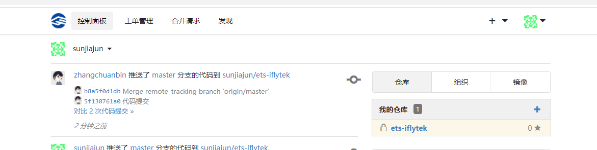
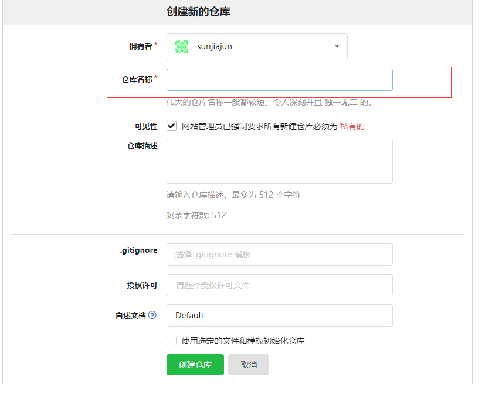
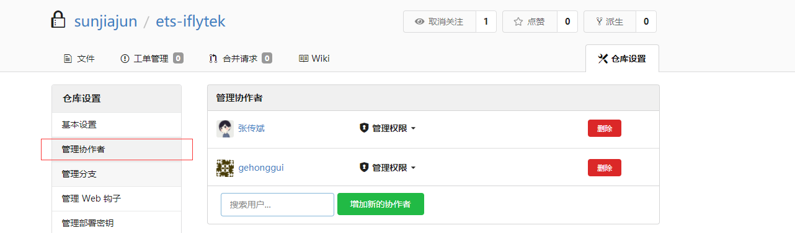
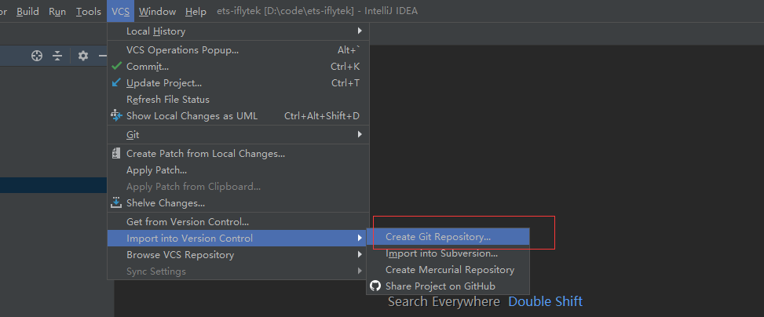
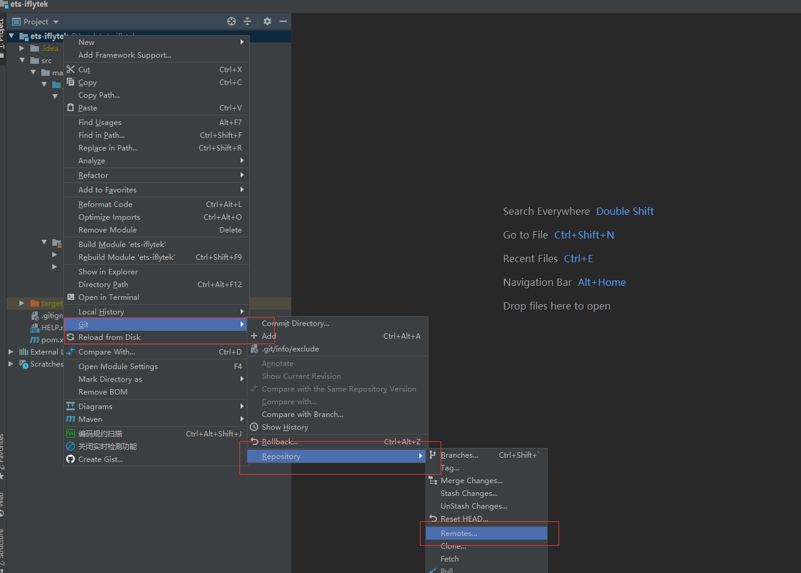
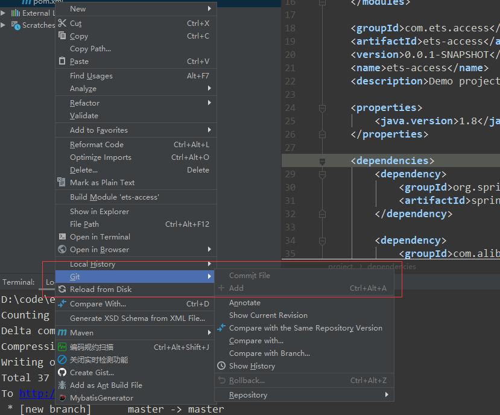

## git

### 1.基础知识和安装

```sh
git由c语言编写，分布式版本控制系统，开源
分布式版本控制系统根本没有“中央服务器”，每个人的电脑上都是一个完整的版本库，这样，你工作的时候，就不需要联网了，因为版本库就在你自己的电脑上
```

```sh
#安装
https://git-scm.com/downloads
安装完成后，还需要最后一步设置，在命令行输入：
$ git config --global user.name "Your Name"
$ git config --global user.email "email@example.com"
因为Git是分布式版本控制系统，所以，每个机器都必须自报家门：你的名字和Email地址。
注意`git config`命令的`--global`参数，用了这个参数，表示你这台机器上所有的Git仓库都会使用这个配置，当然也可以对某个仓库指定不同的用户名和Email地址。
对某个仓库指定用户名和Email：
$ git config user.name "Your Name"
$ git config user.email "email@example.com"
还可用$ git config user.name、$ git config user.email查看你的用户名和邮箱
```

### 2.创建版本库

```sh
$ mkdir learngit
$ cd learngit
$ git init
Initialized empty Git repository in /Users/michael/learngit/.git/

vi readme.txt
Git is a version control system.
Git is free software.

$ git config --global user.email "sjiaj1995@163.com"
$  git config --global user.name "jiajun-git"

$ git add readme.txt      用命令git add告诉Git，把文件添加到仓库
$ git commit -m "wrote a readme file"   -m后面输入的是本次提交的说明，可以输入任意内容
#git commit命令执行成功后会告诉你，1 file changed：1个文件被改动（我们新添加的readme.txt文件）；2 insertions：插入了两行内容（readme.txt有两行内容）。
[master (root-commit) eaadf4e] wrote a readme file
 1 file changed, 2 insertions(+)
 create mode 100644 readme.txt
 
 $ git status
On branch master
nothing to commit, working tree clean
git status命令可以让我们时刻掌握仓库当前的状态
```

### 3.版本回退命令

```sh
$ git log
commit 095b6e227c1fa4ec2d3db62b60b750ef2fe7bb14 (HEAD -> master)
Author: jiajun-git <sjiaj1995@163.com>
Date:   Sun Sep 8 18:43:45 2019 +0800

#退出git log 按q 退出

#准备把readme.txt回退到上一个版本，也就是add distributed的那个版本
#首先，Git必须知道当前版本是哪个版本，在Git中，用HEAD表示当前版本，也就是最新的提交1094adb...，上一个版本就是HEAD^，上上一个版本就是HEAD^^，当然往上100个版本写100个^比较容易数不过来，所以写成HEAD~100。
$ git reset --hard HEAD^
HEAD is now at e475afc add distributed

#想再回去怎么办？办法其实还是有的，只要上面的命令行窗口还没有被关掉，你就可以顺着往上找啊找啊，找到那个append GPL的commit id是1094adb...，于是就可以指定回到未来的某个版本，版本号没必要写全，前几位就可以了，Git会自动去找。当然也不能只写前一两位，因为Git可能会找到多个版本号，就无法确定是哪一个了。
$ git reset --hard  38a3775e
HEAD is now at 38a3775 distributed
#如果关掉了命令行窗口，也有办法找到版本号，Git提供了一个命令git reflog用来记录你的每一次命令：
$ git reflog
38a3775 (HEAD -> master) HEAD@{0}: reset: moving to 38a3775e
095b6e2 HEAD@{1}: reset: moving to HEAD^
38a3775 (HEAD -> master) HEAD@{2}: commit: distributed
095b6e2 HEAD@{3}: commit (initial): wrote a readme file

Git在内部有个指向当前版本的HEAD指针，当你回退版本的时候，Git仅仅是把HEAD从指向append GPL：
┌────┐
│HEAD│
└────┘
   │
   └──> ○ append GPL
        │
        ○ add distributed
        │
        ○ wrote a readme file
改为指向add distributed：
┌────┐
│HEAD│
└────┘
   │
   │    ○ append GPL
   │    │
   └──> ○ add distributed
        │
        ○ wrote a readme file
然后顺便把工作区的文件更新了。所以你让HEAD指向哪个版本号，你就把当前版本定位在哪。


#git checkout 命令
git checkout branchname  切换分支

git checkout -b branchname 创建并切换到新的分支.
这个命令是将git branch newbranch和git checkout newbranch合在一起的结果

只放弃工作区的改动，暂存区保持不变，其实就是从当前 暂存区 恢复 工作区：
放弃工作区中全部的修改
git checkout .

放弃工作区中某个文件的修改：
git checkout -- filename
先使用 git status 列出文件，然后 git checkout -- app/Http/Controllers/Read/Read3Controller.php

2、强制放弃 暂存区 和 工作区 的改动：
git checkout -f
```


### 4.工作区和暂存区

```sh
工作区（Working Directory）
就是你在电脑里能看到的目录，比如我的learngit文件夹就是一个工作区：

版本库（Repository）
工作区有一个隐藏目录.git，这个不算工作区，而是Git的版本库。
Git的版本库里存了很多东西，其中最重要的就是称为stage（或者叫index）的暂存区，还有Git为我们自动创建的第一个分支master，以及指向master的一个指针叫HEAD。
```


```sh
第一步是用git add把文件添加进去，实际上就是把文件修改添加到暂存区；
第二步是用git commit提交更改，实际上就是把暂存区的所有内容提交到当前分支。
因为我们创建Git版本库时，Git自动为我们创建了唯一一个master分支，所以，现在，git commit就是往master分支上提交更改。
#如果要提交到版本库一定要先git add ,在git commit ,只有提交到暂存区才能到版本库
```

```sh
#撤销修改：
$ git checkout -- readme.txt
让这个文件回到最近一次git commit或git add时的状态。
把readme.txt文件在工作区的修改全部撤销，这里有两种情况：
一种是readme.txt自修改后还没有被放到暂存区，现在，撤销修改就回到和版本库一模一样的状态；
一种是readme.txt已经添加到暂存区后，又作了修改，现在，撤销修改就回到添加到暂存区后的状态。
#即，此命令只能撤销git add 或者git commit之前的工作区的内容

#如果git add后没有git commit ,想撤销git add，还可以用reset命令
$ git reset HEAD readme.txt
所以git reset命令既可以回退版本，也可以把暂存区的修改回退到工作区。
```

```sh
#删除文件
用命令git rm删掉，并且git commit：
$ git rm test.txt
rm 'test.txt'
$ git commit -m "remove test.txt"
[master d46f35e] remove test.txt
 1 file changed, 1 deletion(-)
 delete mode 100644 test.txt
```

 

### 5.远程仓库

```sh
第1步：创建SSH Key。在用户主目录下，看看有没有.ssh目录，如果有，再看看这个目录下有没有id_rsa和id_rsa.pub这两个文件，如果已经有了，可直接跳到下一步。如果没有，打开Shell（Windows下打开Git Bash），创建SSH Key：
$ ssh-keygen -t rsa -C "sjiaj1995@163.com"
Generating public/private rsa key pair.
Enter file in which to save the key (/c/Users/84614/.ssh/id_rsa):
Created directory '/c/Users/84614/.ssh'.
Enter passphrase (empty for no passphrase):
Enter same passphrase again:
Your identification has been saved in /c/Users/84614/.ssh/id_rsa.
Your public key has been saved in /c/Users/84614/.ssh/id_rsa.pub.
The key fingerprint is:
SHA256:sq/xi7PY9uImrvTvX9D9buaI1JVU+rWrg9jIi4tZ02o sjiaj1995@163.com
The key's randomart image is:
+---[RSA 2048]----+
|                .|
|               o |
|              o .|
|         . . . oo|
|      . S . . o..|
|       o.. . o  .|
|  .   oo..* o .. |
| . ..oOE+* + ++  |
|  .o+XX@Boo .=+  |
+----[SHA256]-----+

第2步：登陆GitHub，打开“Account settings”，“SSH Keys”页面：
然后，点“Add SSH Key”，填上任意Title，在Key文本框里粘贴id_rsa.pub文件的内容：
```

```sh
#添加远程仓库
在github上创建learngit仓库
在本地的learngit仓库下运行命令：
$ git remote add origin git@github.com:jiajun-git/learngit.git
远程库的名字就是origin，这是Git默认的叫法，也可以改成别的，但是origin这个名字一看就知道是远程库。
$ git push -u origin master
The authenticity of host 'github.com (13.250.177.223)' can't be established.
RSA key fingerprint is SHA256:nThbg6kXUpJWGl7E1IGOCspRomTxdCARLviKw6E5SY8.
Are you sure you want to continue connecting (yes/no)? yes
Warning: Permanently added 'github.com,13.250.177.223' (RSA) to the list of known hosts.
Enumerating objects: 9, done.
Counting objects: 100% (9/9), done.
Delta compression using up to 8 threads
Compressing objects: 100% (6/6), done.
Writing objects: 100% (9/9), 712 bytes | 89.00 KiB/s, done.
Total 9 (delta 2), reused 0 (delta 0)
remote: Resolving deltas: 100% (2/2), done.
To github.com:jiajun-git/learngit.git
 * [new branch]      master -> master
Branch 'master' set up to track remote branch 'master' from 'origin'.

之后提交不用再加-u参数：
git push origin master

#修改远程仓库
git remote set-url origin url
#查看远程仓库
git remote -v
```

```sh
#从远程库克隆并且上传新的代码
在指定目录下git bash
git clone git@github.com:jiajun-git/gitskills.git
或者点击github上的clone按钮，复制https地址
git clone https://github.com/jiajun-git/gitskills.git

克隆下来之后如果需要更改用户名和邮箱见第二节
然后可进行修改、git add、git commint、git push origin master

Git支持多种协议，默认的git://(git@github.com:jiajun-git/gitskills.git)使用ssh，但也可以使用https等其他协议。使用https除了速度慢以外，还有个最大的麻烦是每次推送都必须输入口令,原生git协议速度最快
```

### 6.分支

```sh
#创建与合并分支
首先，我们创建dev分支，然后切换到dev分支：
$ git checkout -b dev
Switched to a new branch 'dev'

git checkout命令加上-b参数表示创建并切换，相当于以下两条命令：
$ git branch dev
$ git checkout dev
Switched to branch 'dev'

然后，用git branch命令查看当前分支：
$ git branch
* dev
  master
git branch命令会列出所有分支，当前分支前面会标一个*号。
然后，我们就可以在dev分支上正常提交，比如对readme.txt做个修改，加上一行：
Creating a new branch is quick.
然后提交：
$ git add readme.txt 
$ git commit -m "branch test"
[dev b17d20e] branch test
 1 file changed, 1 insertion(+)
现在，dev分支的工作完成，我们就可以切换回master分支：
$ git checkout master
Switched to branch 'master'
```


```sh
我们把dev分支的工作成果合并到master分支上：
$ git merge dev
Updating d46f35e..b17d20e
Fast-forward
 readme.txt | 1 +
 1 file changed, 1 insertion(+)
#git merge命令用于合并指定分支到当前分支
因为创建、合并和删除分支非常快，所以Git鼓励你使用分支完成某个任务，合并后再删掉分支，这和直接在master分支上工作效果是一样的，但过程更安全。
#删除分支
$ git branch -d dev
Deleted branch dev (was b17d20e).

切换分支使用git checkout <branch>，而前面讲过的撤销修改则是git checkout -- <file>，同一个命令，有两种作用，确实有点令人迷惑。
实际上，切换分支这个动作，用switch更科学。因此，最新版本的Git提供了新的git switch命令来切换分支：
创建并切换到新的dev分支，可以使用：
$ git switch -c dev
直接切换到已有的master分支，可以使用：
$ git switch master
```


```sh
#合并分支时，Git会用Fast forward模式，但这种模式下，删除分支后，会丢掉分支信息。如果要强制禁用Fast forward模式，Git就会在merge时生成一个新的commit，这样，从分支历史上就可以看出分支信息。下面我们实战一下--no-ff方式的git merge：
$ git merge --no-ff -m "merge with no-ff" dev
Merge made by the 'recursive' strategy.
 readme.txt | 1 +
 1 file changed, 1 insertion(+)
因为本次合并要创建一个新的commit，所以加上-m参数，把commit描述写进去。
#git merge和git merge --no-ff的区别
$ git log --graph   （git merge）
* commit 6266234a8faec97e6b72541c5bedc931c4aa0aad (HEAD -> master, dev)
| Author: jiajun-git <sjiaj1995@163.com>
| Date:   Tue Sep 24 21:20:18 2019 +0800
|
|     no off branch dev
|
*   commit b0189f2a3c8d094fcb7f323d94ae69c0fbdc9c0b

$ git log --graph    （git merge --no-ff）
*   commit 057ece5feed9292797c69ff63de1a4b71956984b (HEAD -> master)
|\  Merge: 6266234 d5f493d
| | Author: jiajun-git <sjiaj1995@163.com>
| | Date:   Tue Sep 24 21:24:08 2019 +0800
| |
| |     merge with no-ff
| |
| * commit d5f493d4eb391a4fcf337e6a463bba7fd3040d6b (dev)
|/  Author: jiajun-git <sjiaj1995@163.com>
|   Date:   Tue Sep 24 21:23:40 2019 +0800
|
|       no off branch
|
* commit 6266234a8faec97e6b72541c5bedc931c4aa0aad
| Author: jiajun-git <sjiaj1995@163.com>
| Date:   Tue Sep 24 21:20:18 2019 +0800
|
|     no off branch dev

#此模式下图如下：
```


```sh
#解决冲突
$ git checkout master
Switched to branch 'master'
Your branch is ahead of 'origin/master' by 1 commit.
  (use "git push" to publish your local commits)

$ vi readme.txt

$ git add readme.txt

$ git commint -m "branch master"
git: 'commint' is not a git command. See 'git --help'.

The most similar command is
        commit

$ git commit -m "branch master"
[master 6a4ce52] branch master
 1 file changed, 1 insertion(+)

$ git merge dev
Auto-merging readme.txt
CONFLICT (content): Merge conflict in readme.txt
Automatic merge failed; fix conflicts and then commit the result.

vi readme.txt
Git is a version control system.
Git is free software.
Git is a distributed version control system.
git commit
git new
Creating a new branch is quick.
<<<<<<< HEAD
git branch master.
=======
git branch dev.
>>>>>>> dev
~

#手动修改冲突的内容，再提交
$ git add readme.txt
$ git commit -m "fix conflict"

#git log --graph命令可以看到分支合并图。
$ git log --graph --pretty=oneline --abbrev-commit
*   b0189f2 (HEAD -> master) fix conflict
|\
| * ea7b684 (dev) branch dev
* | 6a4ce52 branch master
|/
* b6fef88 new branch
* 075f551 (origin/master) five step
* b1055ae first step
* 525faf7 new commit
* 21e43e1 git knowledge01
* 234e97e git knowledge
* fce4e8f commit
* 38a3775 distributed
* 095b6e2 wrote a readme file![git-br-conflict-merged]
```


```sh
#bug分支
软件开发中，有了bug就需要修复，在Git中，由于分支是如此的强大，所以，每个bug都可以通过一个新的临时分支来修复，修复后，合并分支，然后将临时分支删除。
当你接到一个修复一个代号1001的bug的任务时，很自然地，你想创建一个分支issue-1001来修复它，但是，当前正在dev上进行的工作还没有提交，工作只进行到一半，还没法提交，预计完成还需1天时间。但是，必须在两个小时内修复该bug，怎么办？
$ git stash
Saved working directory and index state WIP on dev: f52c633 add merge
Git提供了一个stash功能，可以把当前工作现场“储藏”起来，等以后恢复现场后继续工作

$ git checkout master
$ git checkout -b issue-101
$ git add readme.txt 
$ git commit -m "fix bug 101"
$ git checkout master
$ git merge --no-ff -m "merged bug fix 101" issue-10
$ git checkout dev
$ git stash list
stash@{0}: WIP on dev: f52c633 add merge

工作现场还在，Git把stash内容存在某个地方了，但是需要恢复一下，有两个办法：
一是用git stash apply恢复，但是恢复后，stash内容并不删除，你需要用git stash drop来删除；
另一种方式是用git stash pop，恢复的同时把stash内容也删了：
$ git stash pop

恢复指定的stash，用命令：
$ git stash apply stash@{0}

#分支修复master上相同的bug
在master分支上修复了bug后，dev分支是早期从master分支分出来的，所以，这个bug其实在当前dev分支上也存在。那怎么在dev分支上修复同样的bug？
同样的bug，要在dev上修复，我们只需要把4c805e2 fix bug 101这个提交所做的修改“复制”到dev分支。注意：我们只想复制4c805e2 fix bug 101这个提交所做的修改，并不是把整个master分支merge过来。
为了方便操作，Git专门提供了一个cherry-pick命令，让我们能复制一个特定的提交到当前分支：
$ git branch
* dev
  master
$ git cherry-pick 4c805e2
[master 1d4b803] fix bug 101
 1 file changed, 1 insertion(+), 1 deletion(-)
Git自动给dev分支做了一次提交，注意这次提交的commit是1d4b803，它并不同于master的4c805e2，因为这两个commit只是改动相同，但确实是两个不同的commit。用git cherry-pick，我们就不需要在dev分支上手动再把修bug的过程重复一遍。
有些聪明的童鞋会想了，既然可以在master分支上修复bug后，在dev分支上可以“重放”这个修复过程，那么直接在dev分支上修复bug，然后在master分支上“重放”行不行？当然可以，不过你仍然需要git stash命令保存现场，才能从dev分支切换到master分支。
```

```sh
#删除没有merge的分支
由于特殊情况分支不能被merge，需要删除：
$ git branch -d dev
error: The branch 'dev' is not fully merged.
If you are sure you want to delete it, run 'git branch -D dev'.

$ git branch -D dev
Deleted branch dev (was 336235c).
强行删除。
```

```sh
#远程分支
$ git checkout -b dev origin/dev
$ git push origin dev
git pull也失败了，原因是没有指定本地dev分支与远程origin/dev分支的链接，根据提示，设置dev和origin/dev的链接：
$ git branch --set-upstream-to=origin/dev dev
Branch 'dev' set up to track remote branch 'dev' from 'origin'.
```

```sh
#rebase
多人协作时，看提交记录会很混乱，git rebase能将提交变为一条直线
$ git log --graph --pretty=oneline --abbrev-commit
* d1be385 (HEAD -> master, origin/master) init hello
*   e5e69f1 Merge branch 'dev'
|\  
| *   57c53ab (origin/dev, dev) fix env conflict
| |\  
| | * 7a5e5dd add env
| * | 7bd91f1 add new env
| |/  
* |   12a631b merged bug fix 101
|\ \  
| * | 4c805e2 fix bug 101
|/ /  
* |   e1e9c68 merge with no-ff
|\ \  
| |/  
| * f52c633 add merge
|/  
*   cf810e4 conflict fixed

本地做了add author add comment两次提交，但是git push失败，由于别人先一步提交，所以git pull 你会发现历史分叉了
$ git log --graph --pretty=oneline --abbrev-commit
*   e0ea545 (HEAD -> master) Merge branch 'master' of github.com:michaelliao/learngit
|\  
| * f005ed4 (origin/master) set exit=1
* | 582d922 add author
* | 8875536 add comment
|/  
* d1be385 init hello

$ git rebase
First, rewinding head to replay your work on top of it...
Applying: add comment
Using index info to reconstruct a base tree...
M	hello.py
Falling back to patching base and 3-way merge...
Auto-merging hello.py
Applying: add author
Using index info to reconstruct a base tree...
M	hello.py
Falling back to patching base and 3-way merge...
Auto-merging hello.py

$ git log --graph --pretty=oneline --abbrev-commit
* 7e61ed4 (HEAD -> master) add author
* 3611cfe add comment
* f005ed4 (origin/master) set exit=1
* d1be385 init hello
原本分叉的提交现在变成一条直线了！这种神奇的操作是怎么实现的？其实原理非常简单。我们注意观察，发现Git把我们本地的提交“挪动”了位置，放到了f005ed4 (origin/master) set exit=1之后，这样，整个提交历史就成了一条直线。rebase操作前后，最终的提交内容是一致的，但是，我们本地的commit修改内容已经变化了，它们的修改不再基于d1be385 init hello，而是基于f005ed4 (origin/master) set exit=1，但最后的提交7e61ed4内容是一致的。
这就是rebase操作的特点：把分叉的提交历史“整理”成一条直线，看上去更直观。缺点是本地的分叉提交已经被修改过了。
```


### 7.标签

```sh
发布一个版本时，我们通常先在版本库中打一个标签（tag），这样，就唯一确定了打标签时刻的版本。标签也是版本库的一个快照。
Git的标签虽然是版本库的快照，但其实它就是指向某个commit的指针（跟分支很像对不对？但是分支可以移动，标签不能移动），所以，创建和删除标签都是瞬间完成的。
“请把上周一的那个版本打包发布，版本号是v1.2”
“好的，按照tag v1.2查找commit就行！”
所以，tag就是一个让人容易记住的有意义的名字，它跟某个commit绑在一起。

$ git branch
* dev
  master
$ git checkout master
$ git tag v1.0
$ git tag
v1.0

默认标签是打在最新提交的commit上的。有时候，如果忘了打标签，比如，现在已经是周五了，但应该在周一打的标签没有打，怎么办？方法是找到历史提交的commit id，然后打上就可以了.
$ git tag v0.9 f52c633
#标签不是按时间顺序列出，而是按字母排序的
$ git show v0.9
commit f52c63349bc3c1593499807e5c8e972b82c8f286 (tag: v0.9)
Author: Michael Liao <askxuefeng@gmail.com>
Date:   Fri May 18 21:56:54 2018 +0800

    add merge

diff --git a/readme.txt b/readme.txt
...

还可以创建带有说明的标签，用-a指定标签名，-m指定说明文字：
$ git tag -a v0.1 -m "version 0.1 released" 1094adb

#删除标签
$ git tag -d v0.1
#标签推送到远程
$ git push origin v1.0
Total 0 (delta 0), reused 0 (delta 0)
To github.com:michaelliao/learngit.git
 * [new tag]         v1.0 -> v1.0
或者，一次性推送全部尚未推送到远程的本地标签：
$ git push origin --tags

如果标签已经推送到远程，要删除远程标签就麻烦一点，先从本地删除：
$ git tag -d v0.9
Deleted tag 'v0.9' (was f52c633)
然后，从远程删除。删除命令也是push，但是格式如下：
$ git push origin :refs/tags/v0.9
To github.com:michaelliao/learngit.git
 - [deleted]         v0.9
```


### 8.参与github项目

```sh
如何参与一个开源项目呢？比如人气极高的bootstrap项目，这是一个非常强大的CSS框架，你可以访问它的项目主页https://github.com/twbs/bootstrap，点“Fork”就在自己的账号下克隆了一个bootstrap仓库，然后，从自己的账号下clone：
git clone git@github.com:michaelliao/bootstrap.git
一定要从自己的账号下clone仓库，这样你才能推送修改。如果从bootstrap的作者的仓库地址git@github.com:twbs/bootstrap.git克隆，因为没有权限，你将不能推送修改。
Bootstrap的官方仓库twbs/bootstrap、你在GitHub上克隆的仓库my/bootstrap，以及你自己克隆到本地电脑的仓库，他们的关系就像下图显示的那样：
┌─ GitHub ────────────────────────────────────┐
│                                             │
│ ┌─────────────────┐     ┌─────────────────┐ │
│ │ twbs/bootstrap  │────>│  my/bootstrap   │ │
│ └─────────────────┘     └─────────────────┘ │
│                                  ▲          │
└──────────────────────────────────┼──────────┘
                                   ▼
                          ┌─────────────────┐
                          │ local/bootstrap │
                          └─────────────────┘
如果你想修复bootstrap的一个bug，或者新增一个功能，立刻就可以开始干活，干完后，往自己的仓库推送。
如果你希望bootstrap的官方库能接受你的修改，你就可以在GitHub上发起一个pull request。当然，对方是否接受你的pull request就不一定了。
如果你没能力修改bootstrap，但又想要试一把pull request，那就Fork一下我的仓库：https://github.com/michaelliao/learngit，创建一个your-github-id.txt的文本文件，写点自己学习Git的心得，然后推送一个pull request给我，我会视心情而定是否接受。
```


### 9.码云

```sh
国内的Git托管服务——码云（gitee.com）
我们在本地库上使用命令git remote add把它和码云的远程库关联：
git remote add origin git@gitee.com:liaoxuefeng/learngit.git
之后，就可以正常地用git push和git pull推送了
https://www.liaoxuefeng.com/wiki/896043488029600/1163625339727712
```


### 10.自定义git

```sh
#让Git显示颜色，会让命令输出看起来更醒目：
$ git config --global color.ui true

#忽略文件
有些时候，你必须把某些文件放到Git工作目录中，但又不能提交它们，比如保存了数据库密码的配置文件啦，等等，每次git status都会显示Untracked files ...，有强迫症的童鞋心里肯定不爽。
好在Git考虑到了大家的感受，这个问题解决起来也很简单，在Git工作区的根目录下创建一个特殊的.gitignore文件，然后把要忽略的文件名填进去，Git就会自动忽略这些文件。

忽略文件的原则是：
1.忽略操作系统自动生成的文件，比如缩略图等；
2.忽略编译生成的中间文件、可执行文件等，也就是如果一个文件是通过另一个文件自动生成的，3.那自动生成的文件就没必要放进版本库，比如Java编译产生的.class文件；忽略你自己的带有敏感信息的配置文件，比如存放口令的配置文件。

你确实想添加该文件，可以用-f强制添加到Git：
$ git add -f App.class

或者你发现，可能是.gitignore写得有问题，需要找出来到底哪个规则写错了，可以用git check-ignore命令检查：
$ git check-ignore -v App.class
.gitignore:3:*.class	App.class

#配置别名
如果敲git st就表示git status那就简单多了，当然这种偷懒的办法我们是极力赞成的。
我们只需要敲一行命令，告诉Git，以后st就表示status：
$ git config --global alias.st status

#搭建git服务器
https://www.liaoxuefeng.com/wiki/896043488029600/899998870925664
```

### 11.idea创建springboot项目

+ 新建仓库






+ 添加权限



+ 新建springboot项目

  

+ 添加远程地址

  

+ 如果加后pom文件和类名仍然报红，依次add一下

  

+ 然后先commit 再push即可

  